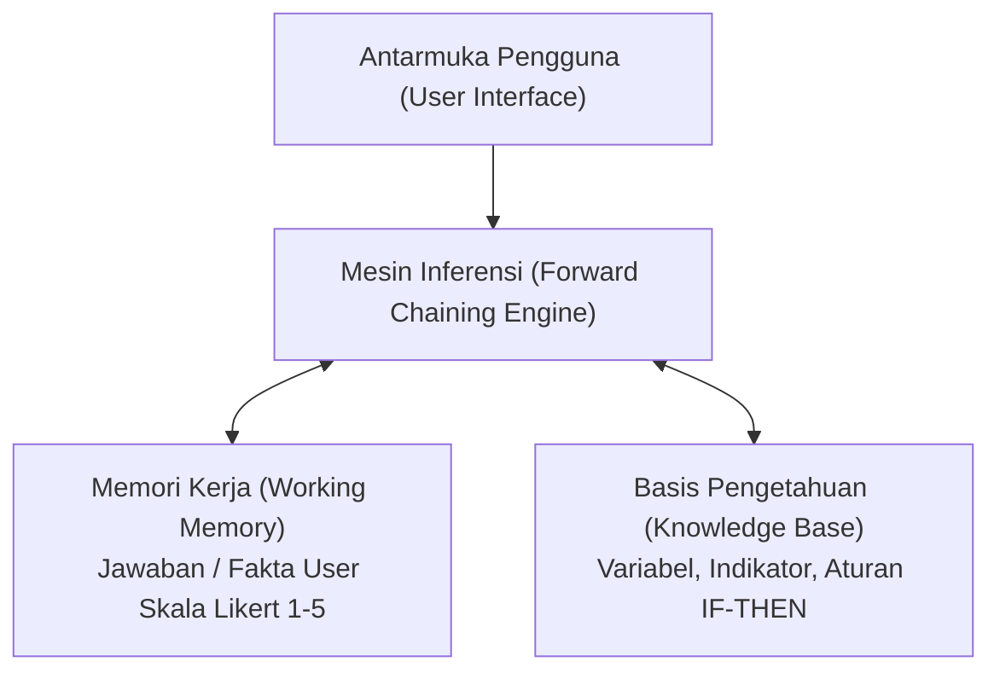
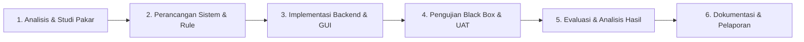
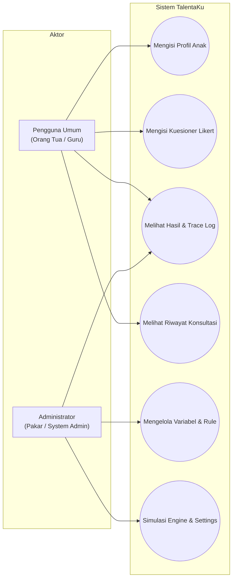
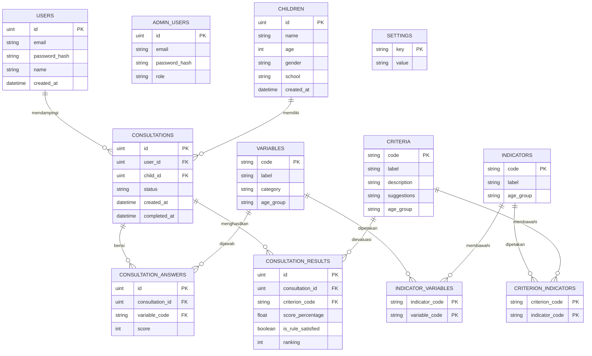

# LAPORAN PROYEK AKHIR
## SISTEM PAKAR PENENTUAN BAKAT ANAK BERBASIS WEBSITE MENGGUNAKAN METODE FORWARD CHAINING (TALENTAKU)

---

### ABSTRAK

Pengenalan dan pemetaan bakat anak sejak usia dini merupakan langkah krusial dalam mengoptimalkan potensi kognitif, afektif, dan psikomotorik anak. Namun, keterbatasan akses terhadap praktisi psikologi anak serta proses asesmen konvensional sering menjadi kendala bagi orang tua dan pendidik. Penelitian ini bertujuan untuk merancang dan mengimplementasikan **TalentaKu**, sebuah sistem pakar berbasis website yang mampu mengidentifikasi kecenderungan bakat anak usia 3 hingga 12 tahun (dengan fokus utama kelompok prasekolah usia 4–6 tahun berbasis standar *US Office of Education* / USOE). Sistem ini menggunakan metode inferensi **Forward Chaining** dua level yang mentransformasikan input observasi perilaku berbasis skala Likert 5 poin menjadi diagnosis kriteria bakat yang akurat. Arsitektur sistem dibangun mengadopsi konsep *decoupled web application* memanfaatkan bahasa pemrograman **Go (Golang)** dengan framework **Fiber v2** dan ORM **GORM** pada sisi *backend*, serta **React v19**, **TypeScript**, dan **Tailwind CSS v4** pada sisi *frontend*. Hasil pengujian sistem melalui metode *Black Box Testing* menunjukkan seluruh fungsi sistem berjalan 100% valid, dan mesin inferensi berhasil menghasilkan *trace log* penelusuran aturan secara transparan serta memberikan rekomendasi jalur pengembangan (*development paths*) yang aplikatif.

**Kata Kunci:** Sistem Pakar, Bakat Anak, Forward Chaining, Skala Likert, USOE, Go Fiber, React TypeScript, TalentaKu.

---

# BAB I PENDAHULUAN

## 1.1 Latar Belakang

Setiap anak lahir dengan keunikan dan potensi bakat yang berbeda-beda. Berdasarkan standar *US Office of Education* (USOE), bakat anak tidak hanya terbatas pada kemampuan akademik intelektual semata, melainkan mencakup enam bidang utama: Intelektual Umum, Akademik Khusus, Berpikir Kreatif dan Produktif, Kepemimpinan, Seni Visual dan Pertunjukan, serta Psikomotorik. Identifikasi dini terhadap bakat ini sangat penting agar orang tua dan pendidik dapat memberikan stimulasi, pola asuh, dan sarana pendidikan yang tepat sasaran sejak usia dini.

Kendala utama yang dihadapi oleh masyarakat umum saat ini adalah terbatasnya aksesibilitas dan tingginya biaya untuk melakukan konsultasi psikometri secara langsung dengan pakar atau psikolog anak. Selain itu, instrumen asesmen mandiri yang beredar seringkali masih bersifat manual dan menggunakan mekanisme pertanyaan biner (*Ya/Tidak* atau *Checkbox*) yang kaku, sehingga kurang mampu menangkap intensitas dan dinamika frekuensi perilaku anak dalam kehidupan sehari-hari.

Untuk mengatasi permasalahan tersebut, dikembangkanlah aplikasi **TalentaKu**, sebuah sistem pakar berbasis website. Sistem ini mengadaptasi dan memperluas landasan penelitian ilmiah yang dilakukan oleh Salisah, Lidya, dan Defit (2015) dalam Jurnal Rekayasa dan Manajemen Sistem Informasi berjudul *"Sistem Pakar Penentuan Bakat Anak dengan Menggunakan Metode Forward Chaining"*. 

Aplikasi **TalentaKu** menghadirkan beberapa inovasi teknologis dan metodologis penting, antara lain:
1. **Mesin Inferensi Forward Chaining Dua Level:** Memproses penalaran berbasis data (*data-driven*) dari fakta variabel observasi menuju pembentukan indikator, hingga menghasilkan kesimpulan kriteria bakat.
2. **Penggunaan Skala Likert 5 Poin:** Mengubah input biner tradisional menjadi 5 skala frekuensi (Tidak Pernah, Jarang, Kadang, Sering, Selalu) untuk menghasilkan analisis persentase kecenderungan bakat yang lebih halus dan representatif.
3. **Penyedia Fitur Trace Log Transparan:** Menampilkan runtutan penalaran aturan (*rule execution trace*) secara terbuka kepada pengguna untuk menjelaskan alasan logis di balik setiap diagnosis bakat yang dihasilkan.
4. **Dashboard Manajemen Pakar Dinamis:** Menyediakan antarmuka *Visual Rule Builder* bagi administrator/pakar untuk mengelola variabel, indikator, dan aturan inferensi secara langsung tanpa perlu mengubah kode program (*hardcoding*).

## 1.2 Rumusan Masalah

Berdasarkan latar belakang di atas, rumusan masalah dalam pengembangan sistem ini adalah:
1. Bagaimana merancang dan membangun arsitektur aplikasi web sistem pakar TalentaKu yang responsif, modern, dan aman mengintegrasikan *backend* Go Fiber dan *frontend* React TypeScript?
2. Bagaimana mengimplementasikan algoritma penalaran *Forward Chaining* dua level yang mengombinasikan konversi ambang batas (*threshold*) biner skala Likert dengan mekanisme *ranking fallback* persentase?
3. Bagaimana menyediakan fitur pengelolaan basis pengetahuan dinamis dan transparansi *trace log* inferensi untuk meningkatkan kepercayaan pengguna dan fleksibilitas pakar?

## 1.3 Batasan Masalah

Untuk menjaga fokus penelitian dan pengembangan, ditetapkan batasan masalah sebagai berikut:
1. **Domain Pengetahuan:** Mengacu pada 6 kategori kriteria bakat standar USOE (Intelektual Umum, Akademik Khusus, Berpikir Kreatif, Kepemimpinan, Seni, dan Psikomotorik).
2. **Subjek & Instrumen:** Fokus utama basis pengetahuan instrumen ditujukan untuk anak prasekolah/TK (usia 4–6 tahun) yang terdiri dari 83 variabel (C1–C83), 27 indikator (I1–I27), dan 33 aturan inferensi. Sistem juga menyediakan fondasi struktur untuk kelompok usia Batita (3 tahun), SD Awal (7–9 tahun), dan SD Akhir (10–12 tahun).
3. **Pengguna Sistem:** Pengguna terbagi menjadi dua peran, yaitu Pengguna Umum (Orang Tua/Guru) untuk pengisian asesmen dan melihat riwayat, serta Administrator (Pakar/Pengelola) untuk manajemen data dan basis pengetahuan.
4. **Lingkup Teknologi:** Backend dibangun dengan Go (Golang) v1.26, framework Fiber v2, ORM GORM, dan database SQLite (dapat ditransisikan ke PostgreSQL). Frontend dibangun dengan React v19, TypeScript, Vite, dan Tailwind CSS v4.

## 1.4 Tujuan Penelitian

Tujuan yang ingin dicapai melalui penelitian dan pengembangan proyek ini adalah:
1. Menghasilkan sistem pakar berbasis website yang mudah diakses oleh orang tua dan pendidik dalam mengidentifikasi kecenderungan bakat anak secara mandiri.
2. Menerapkan algoritma *Forward Chaining* dua level yang presisi dalam mentransformasikan data jawaban observasi menjadi diagnosis kriteria bakat.
3. Menyediakan fasilitas *Visual Rule Builder* dan *Simulation Engine* pada dashboard admin untuk memfasilitasi pengujian dan pembaruan basis pengetahuan oleh pakar secara dinamis.

## 1.5 Manfaat Penelitian

Penelitian ini diharapkan memberikan manfaat sebagai berikut:
* **Bagi Orang Tua dan Pendidik:** Memperoleh panduan ilmiah dan rekomendasi aktivitas eksplorasi bakat anak (*development paths*) yang rinci dan aplikatif guna mendukung tumbuh kembang anak secara optimal.
* **Bagi Pakar / Institusi Pendidikan:** Memiliki media digital yang efisien untuk mendokumentasikan, mensimulasikan, dan mengelola aturan-aturan psikometri secara terstruktur.
* **Bagi Pengembang & Akademisi:** Memberikan contoh konkrit implementasi arsitektur *web API* modern dengan integrasi mesin sistem pakar berbasis bahasa pemrograman Go.

---

# BAB II TINJAUAN PUSTAKA

## 2.1 Konsep Sistem Pakar

Sistem Pakar (*Expert System*) adalah cabang dari Kecerdasan Buatan (*Artificial Intelligence*) yang mengadopsi pengetahuan, penalaran, dan pengalaman seorang pakar manusia ke dalam komputer agar dapat memecahkan masalah spesifik yang biasanya membutuhkan keahlian tingkat tinggi.

### Komponen Utama Sistem Pakar
Arsitektur umum sistem pakar terdiri atas lima komponen utama:
1. **Antarmuka Pengguna (*User Interface*):** Media interaksi antara pengguna dan sistem untuk memasukkan data fakta dan menerima hasil inferensi.
2. **Basis Pengetahuan (*Knowledge Base*):** Tempat menyimpan fakta-fakta observasi serta aturan-aturan (*rules*) logis yang diperoleh dari pakar.
3. **Memori Kerja (*Working Memory / Fact Base*):** Tempat menyimpan fakta-fakta temporer yang dimasukkan oleh pengguna maupun fakta baru yang dihasilkan selama proses inferensi berjalan.
4. **Mesin Inferensi (*Inference Engine*):** Otak dari sistem pakar yang melakukan analisis penalaran dan mencocokkan fakta-fakta dalam memori kerja dengan aturan pada basis pengetahuan untuk menarik kesimpulan.
5. **Fasilitas Penjelasan (*Explanation Facility*):** Modul yang memberikan penjelasan atau runtutan penelusuran (*trace*) kepada pengguna mengenai bagaimana suatu kesimpulan dapat dicapai oleh sistem.



## 2.2 Metode Forward Chaining

### Pengertian Forward Chaining
*Forward Chaining* (Penalaran Maju) adalah metode pencarian atau teknik inferensi yang memulai proses penalaran dari sekumpulan fakta yang diketahui (*data-driven*), kemudian menguji aturan-aturan IF-THEN yang cocok untuk menghasilkan fakta-fakta baru hingga kesimpulan akhir (goal) tercapai.

### Cara Kerja Forward Chaining Dua Level pada TalentaKu
Pada sistem TalentaKu, penalaran maju dilaksanakan dalam dua tingkatan hirarki:
* **Level 1 (Variabel $\rightarrow$ Indikator):** Evaluasi fakta variabel observasi ($C_1, C_2, \dots$). Jika variabel-variabel penyusun suatu indikator memenuhi ambang batas (*threshold*), maka indikator tersebut dinyatakan aktif/terpenuhi ($I = \text{True}$).
* **Level 2 (Indikator $\rightarrow$ Kriteria Bakat):** Evaluasi kombinasi indikator-indikator yang aktif menggunakan operasi logika AND. Jika seluruh indikator pendukung suatu kriteria terpenuhi, maka Kriteria Bakat tersebut dinyatakan terbukti (*Rule Satisfied*).

### Kelebihan dan Kekurangan
* **Kelebihan:** Sangat cocok untuk masalah yang diawali dengan pengumpulan fakta lengkap (seperti kuesioner observasi), mampu menghasilkan banyak kesimpulan relevan sekaligus dari satu kali proses inferensi, serta alur penelusurannya searah dan mudah dilacak.
* **Kekurangan:** Memerlukan pengumpulan seluruh fakta di awal sebelum inferensi dijalankan dan membutuhkan struktur pengelompokan aturan yang rapi agar tidak terjadi *rule explosion*.

## 2.3 Basis Pengetahuan

Basis pengetahuan pada TalentaKu direpresentasikan dalam bentuk aturan implikasi logis **IF-THEN**:
* **Fakta (Variable / Code C):** Pernyataan perilaku observabel anak, contohnya: *C1 = Memiliki perbendaharaan kata yang kaya*.
* **Indikator (Code I):** Pengelompokan fakta ke dalam aspek kompetensi spesifik, contohnya: *I1 = Perbendaharaan kata tinggi*.
* **Aturan Level 1:** `IF C1(true) AND C2(true) AND C3(true) THEN I1(true)`.
* **Kriteria Bakat (Code K):** Kategori bakat utama USOE, contohnya: *K1 = Intelektual Umum*.
* **Aturan Level 2:** `IF I1(true) AND I2(true) AND I3(true) THEN K1(true)`.

## 2.4 Teknologi Pengembangan Website

Sistem dikembangkan dengan menggunakan stack teknologi modern terpisah (*decoupled architecture*):
1. **Go (Golang) & Fiber v2:** Bahasa pemrograman terkompilasi tingkat tinggi yang cepat dan efisien. Fiber adalah framework web berbasis Fasthttp dengan performa rotasi I/O sangat tinggi untuk melayani RESTful API.
2. **GORM & SQLite:** GORM berfungsi sebagai Object Relational Mapper untuk mengelola pemetaan objek Go ke tabel database. SQLite digunakan sebagai database tersemat yang ringan dan handal.
3. **React v19 & TypeScript:** Library komponen antarmuka deklaratif dengan tipe data statis ketat untuk menjamin keandalan kode frontend.
4. **Tailwind CSS v4 & Vite:** Engine styling utility-first terbaru dipadukan dengan Vite sebagai pembangun modul frontend super cepat.
5. **JWT & Bcrypt:** Mengamankan sesi otentikasi antarmuka admin dan pengguna umum.

## 2.5 Penelitian Terdahulu

Penelitian ini berpatokan pada studi Salisah, Lidya, dan Defit (2015) di Jurnal Rekayasa dan Manajemen Sistem Informasi. Tabel 2.1 menyajikan perbandingan antara penelitian terdahulu dan pengembangan sistem TalentaKu.

**Tabel 2.1 Perbandingan Penelitian Terdahulu dan Sistem TalentaKu**

| Parameter | Penelitian Salisah et al. (2015) | Sistem TalentaKu (Penelitian Ini) |
| :--- | :--- | :--- |
| **Metode Input** | Checkbox Biner (Ya/Tidak) | Skala Likert 5 Poin (1-5) |
| **Rentang Usia** | Prasekolah (4-6 Tahun) saja | 4 Kelompok Usia (3 th, 4-6 th, 7-9 th, 10-12 th) |
| **Arsitektur** | Web Monolitik Tradisional | Decoupled REST API (Go Fiber + React TS) |
| **Output Diagnosis** | Keputusan biner kaku | Top-3 Ranking Persentase + Rule Status |
| **Transparansi** | Tidak menampilkan trace log | Trace Log Penelusuran Aturan Transparan |
| **Manajemen Rule** | Hardcoded / Static DB | Visual Rule Builder & Simulation Engine |

---

# BAB III METODOLOGI

## 3.1 Tahapan Penelitian

Penelitian dan pengembangan sistem TalentaKu dilaksanakan mengikuti tahapan metodologi rekayasa perangkat lunak sistematis:



## 3.2 Pengumpulan Data

Data basis pengetahuan dikumpulkan melalui empat teknik:
1. **Studi Literatur:** Mempelajari dokumen standar psikometri bakat anak USOE (*US Office of Education*) serta publikasi jurnal ilmiah Salisah et al. (2015).
2. **Wawancara & Pembimbingan Pakar:** Mendiskusikan pengelompokan indikator dan ambang batas toleransi perilaku anak dengan pakar pendidik anak usia dini.
3. **Observasi Indikator:** Menyusun rincian deskripsi perilaku konkret untuk setiap item pertanyaan skala Likert agar mudah dipahami oleh orang tua.
4. **Dokumentasi Kode & Schema:** Mengompilasi 83 variabel, 27 indikator, dan 33 aturan ke dalam format struktur data JSON dan seed database.

## 3.3 Analisis Kebutuhan Sistem

### Kebutuhan Fungsional (Functional Requirements)
* **Pengguna Umum (Orang Tua / Guru):**
  * Memilih kelompok usia anak dan mengisi data profil anak (*Intake Form*).
  * Melakukan konsultasi mandiri mengisi kuesioner observasi 83 pertanyaan berbasis skala Likert 5 poin.
  * Melihat hasil diagnosa berupa Top-3 Bakat, persentase kecocokan, dan saran pengembangan.
  * Memeriksa *Trace Log* untuk mengetahui alasan logis di balik diagnosis.
  * Menelaah riwayat konsultasi anak yang telah dilakukan sebelumnya.
* **Administrator (Pakar / Pengelola):**
  * Autentikasi aman menggunakan Email & Password (JWT Token).
  * Melihat statistik agregat sebaran bakat dan volume asesmen.
  * Mengelola data variabel (CRUD Variabel C1–C83) dan Indikator (CRUD Indikator I1–I27).
  * Mengatur relasi hirarki aturan pada *Visual Rule Builder*.
  * Menguji cobakan aturan baru pada *Simulation Engine*.
  * Mengubah variabel konfigurasi sistem (seperti nilai *Threshold* biner).

### Kebutuhan Non-Fungsional (Non-Functional Requirements)
* **Performa:** Respon mesin inferensi backend Go kurang dari 50 milidetik per sesi asesmen.
* **Keamanan:** Enkripsi password menggunakan algortima Bcrypt hashing dan enkapsulasi endpoint API dengan protokol JWT.
* **Usability:** Antarmuka responsif (Mobile & Desktop friendly) berbasis komponen Phantom UI dan Tailwind CSS.

## 3.4 Perancangan Sistem

### Use Case Diagram



### Perancangan Database (ERD dan Struktur Tabel)

Database dirancang menggunakan GORM ORM dengan 12 tabel utama yang saling berelasi untuk mengelola data asesmen bakat anak.

**Gambar 3.1 Skema Relasi Antar Tabel (Entity Relationship Diagram)**



---

#### Kamus Data / Struktur Tabel Database

Berikut adalah rincian struktur dan tipe data untuk 12 tabel database yang digunakan oleh sistem **TalentaKu**:

##### 1. Tabel `users` (Data Akun Pengguna Umum)
Menyimpan informasi kredensial akun orang tua atau guru pendamping yang melakukan registrasi.

| Nama Kolom | Tipe Data | Keterangan / Aturan | Deskripsi |
|---|---|---|---|
| `id` | `uint` | PK, Auto Increment | ID unik pengguna |
| `email` | `varchar(100)` | Unique, Not Null | Alamat email pengguna |
| `password_hash` | `text` | Not Null | Kata sandi yang di-hash (Bcrypt) |
| `name` | `varchar(255)` | Not Null | Nama lengkap pengguna |
| `created_at` | `datetime` | Default: Current Timestamp | Waktu pendaftaran akun |

##### 2. Tabel `admin_users` (Data Akun Administrator / Pakar)
Menyimpan data kredensial akses untuk administrator dashboard/pakar.

| Nama Kolom | Tipe Data | Keterangan / Aturan | Deskripsi |
|---|---|---|---|
| `id` | `uint` | PK, Auto Increment | ID unik admin |
| `email` | `varchar(100)` | Unique, Not Null | Alamat email admin |
| `password_hash` | `text` | Not Null | Kata sandi yang di-hash (Bcrypt) |
| `role` | `varchar(50)` | Not Null | Peran pengguna (`superadmin`/`admin`) |

##### 3. Tabel `children` (Data Profil Anak)
Menyimpan data identitas anak yang akan mengikuti asesmen bakat.

| Nama Kolom | Tipe Data | Keterangan / Aturan | Deskripsi |
|---|---|---|---|
| `id` | `uint` | PK, Auto Increment | ID unik profil anak |
| `name` | `varchar(255)` | Not Null | Nama lengkap anak |
| `age` | `int` | Not Null | Usia anak (4–6 tahun) |
| `gender` | `varchar(10)` | Not Null | Jenis kelamin (`male` / `female`) |
| `school` | `varchar(255)` | - | Nama sekolah atau TK asal |
| `created_at` | `datetime` | Default: Current Timestamp | Waktu profil anak dibuat |

##### 4. Tabel `variables` (Daftar Variabel Perilaku)
Menyimpan 83 butir variabel perilaku observasi (C1 s/d C83).

| Nama Kolom | Tipe Data | Keterangan / Aturan | Deskripsi |
|---|---|---|---|
| `code` | `varchar(10)` | PK | Kode unik variabel (C1–C83) |
| `label` | `text` | Not Null | Kalimat perilaku observabel anak |
| `category` | `varchar(100)` | Not Null | Kategori bidang kriteria bakat |
| `age_group` | `varchar(30)` | Default: 'preschool' | Kelompok usia sasaran variabel |

##### 5. Tabel `indicators` (Daftar Indikator Kompetensi)
Menyimpan 27 indikator kompetensi (I1 s/d I27).

| Nama Kolom | Tipe Data | Keterangan / Aturan | Deskripsi |
|---|---|---|---|
| `code` | `varchar(10)` | PK | Kode unik indikator (I1–I27) |
| `label` | `text` | Not Null | Nama/deskripsi indikator kompetensi |
| `age_group` | `varchar(30)` | Default: 'preschool' | Kelompok usia sasaran indikator |

##### 6. Tabel `indicator_variables` (Tabel Relasi Indikator ke Variabel)
Tabel pemetaan relasi banyak-ke-banyak (Level 1) antara indikator dengan variabel penyusunnya.

| Nama Kolom | Tipe Data | Keterangan / Aturan | Deskripsi |
|---|---|---|---|
| `indicator_code` | `varchar(10)` | PK, FK to `indicators.code` | Kode indikator induk |
| `variable_code` | `varchar(10)` | PK, FK to `variables.code` | Kode variabel anggota |

##### 7. Tabel `criteria` (Daftar Kriteria Bakat)
Menyimpan 6 kriteria utama bakat anak berdasarkan standar USOE (K1 s/d K6).

| Nama Kolom | Tipe Data | Keterangan / Aturan | Deskripsi |
|---|---|---|---|
| `code` | `varchar(10)` | PK | Kode unik kriteria bakat (K1–K6) |
| `label` | `varchar(255)` | Not Null | Nama kategori bakat |
| `description` | `text` | Not Null | Penjelasan detail tentang karakteristik kriteria bakat |
| `suggestions` | `text` | Not Null | Saran aktivitas pengembangan bakat bagi orang tua |
| `age_group` | `varchar(30)` | Default: 'preschool' | Kelompok usia sasaran kriteria |

##### 8. Tabel `criterion_indicators` (Tabel Relasi Kriteria ke Indikator)
Tabel pemetaan relasi banyak-ke-banyak (Level 2) antara kriteria bakat dengan indikator penyusunnya.

| Nama Kolom | Tipe Data | Keterangan / Aturan | Deskripsi |
|---|---|---|---|
| `criterion_code` | `varchar(10)` | PK, FK to `criteria.code` | Kode kriteria induk |
| `indicator_code` | `varchar(10)` | PK, FK to `indicators.code` | Kode indikator anggota |

##### 9. Tabel `consultations` (Sesi Konsultasi Asesmen)
Menyimpan informasi sesi asesmen/konsultasi yang berlangsung di sistem.

| Nama Kolom | Tipe Data | Keterangan / Aturan | Deskripsi |
|---|---|---|---|
| `id` | `uint` | PK, Auto Increment | ID unik sesi konsultasi |
| `user_id` | `uint` | Nullable, FK to `users.id` | ID pengguna pendamping (jika login) |
| `child_id` | `uint` | FK to `children.id` | ID profil anak yang dinilai |
| `status` | `varchar(50)` | Not Null | Status pengisian (`IN_PROGRESS` / `COMPLETED`) |
| `created_at` | `datetime` | Default: Current Timestamp | Waktu mulai sesi konsultasi |
| `completed_at` | `datetime` | Nullable | Waktu selesai pengerjaan kuesioner |

##### 10. Tabel `consultation_answers` (Detail Jawaban Sesi Asesmen)
Menyimpan skor jawaban Likert (nilai 1–5) untuk masing-masing variabel perilaku pada setiap sesi.

| Nama Kolom | Tipe Data | Keterangan / Aturan | Deskripsi |
|---|---|---|---|
| `id` | `uint` | PK, Auto Increment | ID unik baris jawaban |
| `consultation_id` | `uint` | FK to `consultations.id` | ID sesi konsultasi terkait |
| `variable_code` | `varchar(10)` | FK to `variables.code` | Kode variabel perilaku yang dinilai |
| `score` | `int` | Range 1–5, Not Null | Nilai pilihan jawaban skala Likert (1 - 5) |

##### 11. Tabel `consultation_results` (Hasil Diagnosa Sesi Asesmen)
Menyimpan hasil akhir pemrosesan logika Forward Chaining per kriteria bakat pada setiap sesi.

| Nama Kolom | Tipe Data | Keterangan / Aturan | Deskripsi |
|---|---|---|---|
| `id` | `uint` | PK, Auto Increment | ID unik baris hasil |
| `consultation_id` | `uint` | FK to `consultations.id` | ID sesi konsultasi terkait |
| `criterion_code` | `varchar(10)` | FK to `criteria.code` | Kode kriteria bakat yang dianalisis |
| `score_percentage` | `double` | Range 0.0–100.0 | Persentase kecocokan bakat anak |
| `is_rule_satisfied` | `boolean` | Not Null | Apakah aturan inferensi kriteria bakat terpenuhi secara penuh |
| `ranking` | `int` | Not Null | Urutan peringkat kriteria (1 s/d 6) |

##### 12. Tabel `settings` (Konfigurasi Global Backend)
Menyimpan parameter konfigurasi backend (seperti parameter threshold minimum biner).

| Nama Kolom | Tipe Data | Keterangan / Aturan | Deskripsi |
|---|---|---|---|
| `key` | `varchar(255)` | PK | Nama kunci parameter konfigurasi |
| `value` | `text` | Not Null | Nilai parameter konfigurasi |


## 3.5 Perancangan Basis Pengetahuan

Basis pengetahuan dalam sistem pakar **TalentaKu** dirancang berdasarkan akuisisi pengetahuan dari penelitian ilmiah Salisah, Lidya, dan Defit (2015) di Jurnal Rekayasa dan Manajemen Sistem Informasi (`docs/paper.md`) yang mengacu pada standar bakat anak *US Office of Education* (USOE) America. Basis pengetahuan ini mencakup **6 Kriteria Bakat**, **27 Indikator**, **83 Variabel Observasi Perilaku**, dan **33 Aturan Inferensi (Rules)**.

### 1. Daftar Kriteria Bakat Anak (6 Kategori Utama)
Kriteria bakat direpresentasikan dengan kode K1 hingga K6. Setiap kriteria dibentuk oleh beberapa indikator pendukung sebagaimana disajikan pada Tabel 3.1.

**Tabel 3.1 Daftar Kriteria Bakat Anak Standar USOE (`docs/paper.md`)**

| Kode Kriteria | Kriteria Bakat Anak | Indikator Pendukung (Level 2) | Deskripsi Ringkas |
| :---: | :--- | :--- | :--- |
| **K1** | Intelektual Umum | I1, I2, I3 | Kemampuan kognitif menyeluruh, daya ingat kuat, serta penguasaan kata-kata abstrak. |
| **K2** | Akademik Khusus | I4, I5 | Kemampuan menonjol dalam pemikiran abstrak, konsep angka/matematika dasar, dan sains anak. |
| **K3** | Berpikir Kreatif dan Produktif | I6, I7, I8, I9, I10, I11, I12, I13 | Kelancaran mengemukakan ide unik, imajinasi tinggi, standar personal, serta rasa percaya diri positif. |
| **K4** | Kepemimpinan | I14, I15, I16, I17, I18 | Keterampilan sosial memimpin teman sebaya, tanggung jawab tugas, kerja sama, dan kecenderungan mengarahkan. |
| **K5** | Seni Visual dan Pertunjukan | I19, I20, I21, I22 | Kepekaan estetika pada seni rupa/melukis, nada/musik, gerak tari ekspresif, dan seni drama/peran. |
| **K6** | Psikomotorik | I23, I24, I25, I26, I27 | Keterampilan koordinasi fisik motorik kasar, kelenturan motorik halus, spasial, dan mekanika praktis. |

---

### 2. Daftar Indikator Bakat Anak (27 Indikator)
Indikator (I1–I27) berfungsi sebagai jembatan sintesis antara variabel observasi perilaku dan kriteria bakat utama. Rincian indikator disajikan pada Tabel 3.2.

**Tabel 3.2 Daftar Indikator Bakat Anak (`docs/paper.md`)**

| Kode Indikator | Nama Indikator Bakat Anak | Target Kriteria | Variabel Penyusun (Level 1) |
| :---: | :--- | :---: | :--- |
| **I1** | Tingkat perbendaharaan kata yang tinggi | K1 | C1, C2, C3 |
| **I2** | Mempunyai ingatan kuat | K1 | C4, C5, C6, C7, C8, C9 |
| **I3** | Penguasaan kata-kata abstrak | K1 | C10, C11, C12, C13, C14 |
| **I4** | Memiliki pemikiran abstrak | K2 | C15, C16, C17, C18 |
| **I5** | Memiliki prestasi bidang matematika & sains | K2 | C19, C20, C21, C22, C23, C24, C25 |
| **I6** | Memiliki prestasi sains (eksplorasi) | K3 | C26, C27 |
| **I7** | Keterbukaan terhadap pengalaman | K3 | C28, C29, C30, C31, C32 |
| **I8** | Menetapkan standar personal | K3 | C33, C34 |
| **I9** | Kemampuan memainkan ide-ide | K3 | C35, C36 |
| **I10** | Keinginan untuk menghadapi resiko | K3 | C37, C38, C39, C40 |
| **I11** | Kesukaan terhadap kompleksitas | K3 | C41, C42, C43 |
| **I12** | Toleran terhadap ambiguitas | K3 | C44, C45, C46 |
| **I13** | Image diri yang positif | K3 | C47, C48 |
| **I14** | Kemampuan menyatu dengan tugas | K4 | C49, C50 |
| **I15** | Kepercayaan diri | K4 | C51, C52 |
| **I16** | Tanggung jawab | K4 | C53, C54, C55, C56, C57 |
| **I17** | Kerja sama | K4 | C58, C59 |
| **I18** | Kecenderungan untuk mendominasi | K4 | C60, C61, C62 |
| **I19** | Beradaptasi dengan mudah terhadap situasi baru | K5 | C63, C64 |
| **I20** | Keterbakatan dalam bidang seni visual | K5 | C65, C66 |
| **I21** | Keterbakatan dalam bidang seni musik | K5 | C67, C68 |
| **I22** | Keterbakatan dalam bidang drama | K5 | C69 |
| **I23** | Kemampuan motorik kinestetik | K6 | C70, C71, C72 |
| **I24** | Keterampilan praktik | K6 | C73, C74 |
| **I25** | Keterampilan spasial | K6 | C75, C76, C77 |
| **I26** | Keterampilan mekanika | K6 | C78, C79, C80, C81 |
| **I27** | Keterampilan fisikal | K6 | C82, C83 |

---

### 3. Daftar Variabel Observasi Perilaku Anak (83 Variabel)
Variabel (C1–C83) merupakan item-item observasi perilaku anak dalam kehidupan sehari-hari yang diisi oleh pengguna (orang tua/guru) melalui skala Likert 1–5. Rincian lengkap 83 variabel ditunjukkan pada Tabel 3.3.

**Tabel 3.3 Daftar Variabel Observasi Perilaku Anak C1–C83 (`docs/paper.md`)**

| Kode | Deskripsi Perilaku Observabel Anak | Kategori Bakat | Indikator Induk |
| :---: | :--- | :--- | :---: |
| **C1** | Dapat menirukan kalimat sederhana dengan jelas | Intelektual Umum | I1 |
| **C2** | Dapat meniru kembali 4-5 urutan kata yang didengar | Intelektual Umum | I1 |
| **C3** | Mengulangi kalimat panjang yang baru saja didengarnya secara presisi | Intelektual Umum | I1 |
| **C4** | Menyanyikan lagu anak-anak lebih dari 20 lagu yang berbeda | Intelektual Umum | I2 |
| **C5** | Dapat menyebutkan simbol-simbol huruf vokal dan konsonan | Intelektual Umum | I2 |
| **C6** | Mengucapkan syair lagu secara lantang sambil bersenandung irama | Intelektual Umum | I2 |
| **C7** | Dapat mengelompokkan benda-benda sekitar berdasarkan fungsinya | Intelektual Umum | I2 |
| **C8** | Meniru penulisan berbagai lambang huruf vokal dan konsonan | Intelektual Umum | I2 |
| **C9** | Mengelompokkan peralatan makan, mandi, dan kebersihan secara terpisah | Intelektual Umum | I2 |
| **C10** | Menggunakan dan menjawab pertanyaan apa, mengapa, dimana, berapa, bagaimana | Intelektual Umum | I3 |
| **C11** | Bercerita secara runtut tentang gambar yang disediakan atau buatannya | Intelektual Umum | I3 |
| **C12** | Bercerita menggunakan kata ganti orang (aku, saya, kamu, mereka) | Intelektual Umum | I3 |
| **C13** | Menceritakan kembali pengalaman menarik atau kejadian sederhana | Intelektual Umum | I3 |
| **C14** | Memberikan keterangan lengkap atau informasi spontan tentang suatu hal | Intelektual Umum | I3 |
| **C15** | Dapat menyebutkan urutan bilangan 1 sampai 10 secara runtut | Akademik Khusus | I4 |
| **C16** | Dapat menunjuk lambang bilangan 1 sampai 10 yang ditulis acak | Akademik Khusus | I4 |
| **C17** | Meniru penulisan lambang bilangan 1 sampai 10 | Akademik Khusus | I4 |
| **C18** | Mengenal dan menyebutkan lambang bilangan 1 sampai 20 | Akademik Khusus | I4 |
| **C19** | Membedakan dan membentuk dua kumpulan benda berdasarkan kuantitas | Akademik Khusus | I5 |
| **C20** | Mengenal perbedaan bentuk geometri benda (bulat, segitiga, kotak) | Akademik Khusus | I5 |
| **C21** | Mencoba dan menceritakan tentang proses pencampuran warna | Akademik Khusus | I5 |
| **C22** | Eksperimen menaruh benda ke air lalu menceritakan terapung/tenggelam | Akademik Khusus | I5 |
| **C23** | Menirukan dan menceritakan macam-macam bunyi alam/kendaraan | Akademik Khusus | I5 |
| **C24** | Mengenali dan menceritakan perbedaan macam-macam rasa makanan | Akademik Khusus | I5 |
| **C25** | Menceritakan berbagai jenis bau wewangian atau bau tak sedap | Akademik Khusus | I5 |
| **C26** | Mau mengungkapkan pendapat pribadinya secara sederhana dalam diskusi | Berpikir Kreatif | I6 |
| **C27** | Menjawab pertanyaan dengan antusias ketika dimintai keterangan | Berpikir Kreatif | I6 |
| **C28** | Spontan menyapa teman sebaya maupun orang dewasa yang dikenalnya | Berpikir Kreatif | I7 |
| **C29** | Mengucapkan salam saat masuk ruangan atau bertemu orang lain | Berpikir Kreatif | I7 |
| **C30** | Selalu mengucapkan terima kasih secara sadar setelah memperoleh sesuatu | Berpikir Kreatif | I7 |
| **C31** | Mengekspresikan perasaannya (marah, sedih, gembira) secara wajar | Berpikir Kreatif | I7 |
| **C32** | Membuat perencanaan sederhana mengenai aktivitas bermain yang dilakukan | Berpikir Kreatif | I7 |
| **C33** | Mampu mengambil keputusan sederhana (memilih mainan/pakaian) | Berpikir Kreatif | I8 |
| **C34** | Menggambar bebas dan ekspresif menggunakan berbagai media | Berpikir Kreatif | I8 |
| **C35** | Mau menunjukkan dan membedakan perbuatan yang benar dan salah | Berpikir Kreatif | I9 |
| **C36** | Suka menolong teman atau orang lain yang mengalami kesulitan | Berpikir Kreatif | I9 |
| **C37** | Mau bermain dengan teman tanpa membedakan warna kulit/suku/agama | Berpikir Kreatif | I10 |
| **C38** | Menghargai hasil karya gambar atau bangunan balok temannya | Berpikir Kreatif | I10 |
| **C39** | Mengakui dan memuji keunggulan atau kemampuan teman lain | Berpikir Kreatif | I10 |
| **C40** | Menginisiasi permainan dengan mengajak teman-teman sekitar | Berpikir Kreatif | I10 |
| **C41** | Mau menolong dan mudah memberi maaf kepada teman | Berpikir Kreatif | I11 |
| **C42** | Dapat hidup dan berinteraksi berdampingan dengan teman beda agama | Berpikir Kreatif | I11 |
| **C43** | Memuji teman atau orang lain secara spontan | Berpikir Kreatif | I11 |
| **C44** | Berpakaian rapi, bersih, dan menjaga kesopanan di tempat umum | Berpikir Kreatif | I12 |
| **C45** | Menghormati guru, orang tua, dan orang yang lebih tua | Berpikir Kreatif | I12 |
| **C46** | Mendengarkan dan memperhatikan dengan tenang saat teman berbicara | Berpikir Kreatif | I12 |
| **C47** | Menjaga dan memelihara hasil karyanya sendiri agar tidak rusak | Berpikir Kreatif | I13 |
| **C48** | Mentaati aturan dan kesepakatan dalam permainan bersama | Berpikir Kreatif | I13 |
| **C49** | Berani mengajukan pertanyaan dan menjawab pertanyaan di kelas | Kepemimpinan | I14 |
| **C50** | Bertanggung jawab akan tugas dan merapikan peralatan sendiri | Kepemimpinan | I14 |
| **C51** | Fokus menyelesaikan tugas mandirinya dari awal sampai tuntas | Kepemimpinan | I15 |
| **C52** | Melaksanakan 3-5 perintah berurutan dengan benar | Kepemimpinan | I15 |
| **C53** | Dapat membagi peran dan menyelesaikan tugas kelompok | Kepemimpinan | I16 |
| **C54** | Dapat bekerja sama secara aktif dengan teman sebayanya | Kepemimpinan | I16 |
| **C55** | Mau dan senang bermain dengan teman-teman sebayanya | Kepemimpinan | I16 |
| **C56** | Saling membantu dan inisiatif menolong sesama teman | Kepemimpinan | I16 |
| **C57** | Mau membantu memecahkan atau melerai perselisihan teman | Kepemimpinan | I16 |
| **C58** | Mau berbagi makanan atau barang mainan dengan teman | Kepemimpinan | I17 |
| **C59** | Mau meminjamkan barang miliknya kepada teman | Kepemimpinan | I17 |
| **C60** | Sabar mengantre dan menunggu giliran saat bermain bersama | Kepemimpinan | I18 |
| **C61** | Mengendalikan emosi dengan cara wajar saat keinginan tertunda | Kepemimpinan | I18 |
| **C62** | Dapat menerima kritik atau masukan dari guru/orang tua | Kepemimpinan | I18 |
| **C63** | Melukiskan apa yang dilihat atau didengar pada selembar kertas | Seni Visual & Pertunjukan | I19 |
| **C64** | Menggambar bebas dari bentuk dasar titik, garis, lingkaran, segitiga | Seni Visual & Pertunjukan | I19 |
| **C65** | Dapat memainkan alat musik sederhana (angklung, piano mainan) | Seni Visual & Pertunjukan | I20 |
| **C66** | Dapat memahami dan membedakan tangga nada tinggi-rendah | Seni Visual & Pertunjukan | I20 |
| **C67** | Mengekspresikan gerakan tubuh sesuai syair lagu atau iringan musik | Seni Visual & Pertunjukan | I21 |
| **C68** | Mengekspresikan diri dan emosi wajah dalam gerak tari | Seni Visual & Pertunjukan | I21 |
| **C69** | Mampu bermain peran memerankan karakter tertentu (drama anak) | Seni Visual & Pertunjukan | I22 |
| **C70** | Berjalan, berlari, dan melompat secara seimbang (motorik kasar) | Psikomotorik | I23 |
| **C71** | Melempar dan menangkap bola dengan terarah (koordinasi) | Psikomotorik | I23 |
| **C72** | Meniti papan titian atau berjalan satu garis (keseimbangan dinamis) | Psikomotorik | I23 |
| **C73** | Menggunakan sendok, garpu, dan cangkir minum sendiri dengan rapi | Psikomotorik | I24 |
| **C74** | Membuka/mengancingkan baju atau memakai tali sepatu sendiri | Psikomotorik | I24 |
| **C75** | Menyusun balok tinggi atau merangkai puzzle 12+ keping (spasial) | Psikomotorik | I25 |
| **C76** | Melipat kertas menjadi bentuk sederhana seperti segitiga/amplop | Psikomotorik | I25 |
| **C77** | Menggunting kertas mengikuti pola garis lurus/lingkaran | Psikomotorik | I25 |
| **C78** | Membuka dan memutar tutup botol/toples dengan tangan sendiri | Psikomotorik | I26 |
| **C79** | Memutar mur mainan atau merakit komponen bongkar pasang | Psikomotorik | I26 |
| **C80** | Memegang pensil/krayon dengan pegangan tripod grasp yang benar | Psikomotorik | I26 |
| **C81** | Menggunakan palu mainan atau memasukkan pasak kayu ke lubang | Psikomotorik | I26 |
| **C82** | Berdiri dengan satu kaki selama 5-10 detik secara stabil | Psikomotorik | I27 |
| **C83** | Bergantung atau berayun pada palang besi arena bermain (fisikal) | Psikomotorik | I27 |

---

### 4. Struktur Aturan Inferensi (33 Rules)
Berdasarkan rujukan `docs/paper.md`, mesin inferensi mengeksekusi 33 aturan (*rules*) yang terbagi menjadi Aturan Level 1 (Aturan 1–3, 5–6, 8–15, 17–21, 23–26, 28–32) dan Aturan Level 2 (Aturan 4, 7, 16, 22, 27, 33):

* **Aturan Level 1 (Variabel $\rightarrow$ Indikator):**
  1. `Rule 1`: IF C1 AND C2 AND C3 THEN I1
  2. `Rule 2`: IF C4 AND C5 AND C6 AND C7 AND C8 AND C9 THEN I2
  3. `Rule 3`: IF C10 AND C11 AND C12 AND C13 AND C14 THEN I3
  4. `Rule 5`: IF C15 AND C16 AND C17 AND C18 THEN I4
  5. `Rule 6`: IF C19 AND C20 AND C21 AND C22 AND C23 AND C24 AND C25 THEN I5
  6. `Rule 8`: IF C26 AND C27 THEN I6
  7. `Rule 9`: IF C28 AND C29 AND C30 AND C31 AND C32 THEN I7
  8. `Rule 10`: IF C33 AND C34 THEN I8
  9. `Rule 11`: IF C35 AND C36 THEN I9
  10. `Rule 12`: IF C37 AND C38 AND C39 AND C40 THEN I10
  11. `Rule 13`: IF C41 AND C42 AND C43 THEN I11
  12. `Rule 14`: IF C44 AND C45 AND C46 THEN I12
  13. `Rule 15`: IF C47 AND C48 THEN I13
  14. `Rule 17`: IF C49 AND C50 THEN I14
  15. `Rule 18`: IF C51 AND C52 THEN I15
  16. `Rule 19`: IF C53 AND C54 AND C55 AND C56 AND C57 THEN I16
  17. `Rule 20`: IF C58 AND C59 THEN I17
  18. `Rule 21`: IF C60 AND C61 AND C62 THEN I18
  19. `Rule 23`: IF C63 AND C64 THEN I19
  20. `Rule 24`: IF C65 AND C66 THEN I20
  21. `Rule 25`: IF C67 AND C68 THEN I21
  22. `Rule 26`: IF C69 THEN I22
  23. `Rule 28`: IF C70 AND C71 AND C72 THEN I23
  24. `Rule 29`: IF C73 AND C74 THEN I24
  25. `Rule 30`: IF C75 AND C76 AND C77 THEN I25
  26. `Rule 31`: IF C78 AND C79 AND C80 AND C81 THEN I26
  27. `Rule 32`: IF C82 AND C83 THEN I27

* **Aturan Level 2 (Indikator $\rightarrow$ Kriteria Bakat):**
  1. `Rule 4 (K1 - Intelektual Umum)`: IF I1 AND I2 AND I3 THEN K1
  2. `Rule 7 (K2 - Akademik Khusus)`: IF I4 AND I5 THEN K2
  3. `Rule 16 (K3 - Berpikir Kreatif & Produktif)`: IF I6 AND I7 AND I8 AND I9 AND I10 AND I11 AND I12 AND I13 THEN K3
  4. `Rule 22 (K4 - Kepemimpinan)`: IF I14 AND I15 AND I16 AND I17 AND I18 THEN K4
  5. `Rule 27 (K5 - Seni Visual & Pertunjukan)`: IF I19 AND I20 AND I21 AND I22 THEN K5
  6. `Rule 33 (K6 - Psikomotorik)`: IF I23 AND I24 AND I25 AND I26 AND I27 THEN K6

## 3.6 Implementasi Metode Forward Chaining

Mesin inferensi pada `backend/engine/engine.go` mengeksekusi algoritma penalaran maju melalui tahapan sistematis berikut:

### 1. Konversi Biner Variabel (Threshold Evaluation)
Setiap jawaban variabel $C_j$ bernilai Likert 1–5 dievaluasi terhadap ambang batas $T$ (default $T=4$):
$$\text{IsSatisfied}(C_j) = \begin{cases} \text{True}, & \text{jika } \text{Score}(C_j) \ge T \\ \text{False}, & \text{jika } \text{Score}(C_j) < T \end{cases}$$

### 2. Evaluasi Indikator Level 1
Untuk setiap indikator $I_m$ yang membawahi sejumlah variabel $V(I_m)$:
* Status kebenaran biner indikator:
  $$\text{IsSatisfied}(I_m) = \bigwedge_{v \in V(I_m)} \text{IsSatisfied}(v)$$
* Normalisasi skor persentase indikator:
  $$\text{AvgScore}(I_m) = \frac{1}{|V(I_m)|} \sum_{v \in V(I_m)} \text{Score}(v)$$
  $$\text{ScorePct}(I_m) = \left( \frac{\text{AvgScore}(I_m) - 1.0}{4.0} \right) \times 100\%$$

### 3. Evaluasi Kriteria Level 2 & Ranking Fallback
Untuk setiap kriteria bakat $K_n$ yang membawahi indikator $Ind(K_n)$:
* Status kebenaran biner kriteria (*Rule Satisfied*):
  $$\text{IsRuleSatisfied}(K_n) = \bigwedge_{i \in Ind(K_n)} \text{IsSatisfied}(i)$$
* Skor persentase kriteria bakat:
  $$\text{ScorePct}(K_n) = \frac{1}{|Ind(K_n)|} \sum_{i \in Ind(K_n)} \text{ScorePct}(i)$$
* Seluruh kriteria kemudian diurutkan (*ranking*) dari persentase terbesar ke terkecil. Tiga kriteria teratas (Top-3) ditampilkan sebagai kecenderungan bakat anak.

---

# BAB IV HASIL DAN PEMBAHASAN

## 4.1 Implementasi Sistem

Sistem pakar **TalentaKu** telah berhasil dibangun dan diimplementasikan secara penuh. Berikut adalah penjelasan komponen-komponen antarmuka utama sistem:

### 1. Halaman Landing (Landing Page)
Halaman utama memberikan penjelasan transparan mengenai metode *Forward Chaining*, landasan psikometri standar USOE, serta panduan praktis bagi orang tua sebelum mengulai asesmen.

### 2. Halaman Profil Anak (Child Intake Form)
Formulir awal untuk mencatat identitas anak mencakup nama lengkap, usia (3-12 tahun), jenis kelamin, dan nama sekolah. Pilihan usia akan secara otomatis menentukan kelompok instrumen soal yang sesuai.

### 3. Wizard Asesmen Kuesioner (Assessment Wizard Page)
Antarmuka konsultasi menyajikan 83 pertanyaan observasi (untuk kelompok prasekolah) yang dikelompokkan secara visual berdasarkan bidang kemampuan. Jawaban dipilih menggunakan radio button 5 opsi skala Likert. Antarmuka dilengkapi dengan contoh perilaku konkret (*assessment examples*) untuk memandu persepsi penguji.

### 4. Halaman Hasil Diagnosa (Results Page)
Menampilkan visualisasi Top-3 Bakat menggunakan lencana medali (🥇, 🥈, 🥉), grafik persentase kecocokan kriteria, serta penjelasan naratif mengenai rekomendasi jalur pengembangan (*development paths*). Halaman ini juga menyediakan panel *Inference Trace* transparan.

### 5. Dashboard Admin & Visual Rule Builder
Area khusus administrator untuk memantau statistik sebaran bakat anak terdaftar, melakukan manajemen data variabel/indikator, serta mengonfigurasi aturan inferensi secara visual tanpa coding.

## 4.2 Implementasi Basis Pengetahuan

Basis pengetahuan telah disemai (*seeded*) ke dalam database SQLite (`talentaku.db`). Tabel 4.1 memperlihatkan cuplikan struktur pemetaan basis pengetahuan yang tersimpan.

**Tabel 4.1 Cuplikan Data Pemetaan Variabel, Indikator, dan Kriteria**

| Kode Kriteria | Nama Kriteria | Kode Indikator | Nama Indikator | Kode Variabel Penyusun |
| :--- | :--- | :--- | :--- | :--- |
| **K1** | Intelektual Umum | I1 | Perbendaharaan kata tinggi | C1, C2, C3 |
| **K1** | Intelektual Umum | I2 | Ingatan kuat | C4, C5, C6 |
| **K1** | Intelektual Umum | I3 | Penguasaan kata abstrak | C7, C8, C9 |
| **K2** | Akademik Khusus | I4 | Pemikiran abstrak | C10, C11, C12 |
| **K3** | Berpikir Kreatif | I7 | Keterbukaan pengalaman | C19, C20, C21 |
| **K6** | Psikomotorik | I23 | Motorik kinestetik | C70, C71, C72 |

## 4.3 Proses Inferensi Forward Chaining (Studi Kasus Penelusuran)

Untuk membuktikan kebenaran algoritma mesin inferensi, dilakukan pengujian studi kasus penelusuran fakta pada seorang anak bernama **Ananda Budi** (Usia 5 Tahun).

### Skenario Input Jawaban Sampel (Indikator I1: C1, C2, C3):
* C1 (Perbendaharaan kata kaya): Skor 5 (Selalu)
* C2 (Mengingat istilah baru): Skor 4 (Sering)
* C3 (Mengartikan kata rumit): Skor 4 (Sering)

### Langkah Penelusuran Mesin Inferensi (`engine.go`):
1. **Evaluasi Biner Variabel (Threshold = 4):**
   * $C1 = 5 \ge 4 \rightarrow \text{True}$
   * $C2 = 4 \ge 4 \rightarrow \text{True}$
   * $C3 = 4 \ge 4 \rightarrow \text{True}$
2. **Evaluasi Indikator Level 1 (I1):**
   * $\text{IsSatisfied}(I1) = \text{True} \land \text{True} \land \text{True} = \text{True}$
   * $\text{AvgScore}(I1) = (5 + 4 + 4) / 3 = 4.33$
   * $\text{ScorePct}(I1) = ((4.33 - 1) / 4) \times 100\% = 83.33\%$
3. **Perekaman Trace Log:**
   Mesin menambahkan catatan log: `✓ Indikator I1 (Perbendaharaan kata tinggi) terpenuhi`.
4. **Evaluasi Kriteria Level 2 (K1):**
   Jika indikator I2 dan I3 juga bernilai True, maka aturan `RULE_K1` dinyatakan `RULE TRUE`, dan K1 mendapatkan persentase tinggi serta status *Rule Satisfied*.

## 4.4 Hasil Pengujian Sistem

Pengujian kualitas perangkat lunak dilakukan menggunakan metode **Black Box Testing** untuk menguji fungsionalitas antarmuka dan modul backend.

**Tabel 4.2 Hasil Pengujian Black Box Testing**

| No | Modul / Fitur | Skenario Pengujian | Hasil Yang Diharapkan | Status |
| :---: | :--- | :--- | :--- | :---: |
| 1 | Auth Login Admin | Memasukkan kredensial valid (`admin@talentaku.com`) | Login berhasil, token JWT disimpan, redirect ke dashboard | **VALID** |
| 2 | Child Intake | Mengisi nama, umur 5, gender, dan nama sekolah | Sesi konsultasi terbentuk di DB, masuk ke Wizard | **VALID** |
| 3 | Wizard Asesmen | Memilih skor Likert 1-5 untuk 83 pertanyaan | Skor tersimpan di `consultation_answers`, tombol submit aktif | **VALID** |
| 4 | Engine Forward Chaining | Mengirimkan jawaban asesmen | Sistem memproses penalaran 2 level dan menghitung persentase | **VALID** |
| 5 | Trace Log Display | Membuka panel detail penjelasan hasil | Menampilkan daftar centang hijau/silang merah penelusuran rule | **VALID** |
| 6 | Rule Builder CRUD | Mengubah relasi indikator ke kriteria pada dashboard admin | Data relasi di database terbarui secara otomatis | **VALID** |
| 7 | Simulation Engine | Menguji variabel sampel pada form simulasi admin | Output simulasi menampilkan ranking bakat tanpa menyimpan ke DB utama | **VALID** |

## 4.5 Analisis Hasil

Berdasarkan seluruh tahapan pengujian dan analisis data yang dilakukan, dapat diambil beberapa poin analisis penting:
1. **Akurasi & Transparansi Inferensi:** Penerapan algoritma *Forward Chaining* dua level terbukti sangat presisi dalam mengelompokkan 83 variabel observasi. Kehadiran modul *Trace Log* memberikan transparansi 100% sehingga pengguna paham dasar pertimbangan sistem.
2. **Fleksibilitas Skala Likert:** Penggunaan skala Likert 5-poin terbukti mampu mengatasi kelemahan metode biner tradisional. Anak yang memiliki kecenderungan perilaku pada kategori "Sering" tetap dapat terdeteksi bakatnya melalui perhitungan persentase gradien, meskipun ada beberapa variabel yang belum mencapai nilai ekstrem "Selalu".
3. **Performa Backend Go Fiber:** Backend yang dibangun menggunakan Go Fiber menunjukkan efisiensi eksekusi memori yang sangat ringan (< 15 MB RAM) dengan waktu tanggap (*latency*) pemrosesan inferensi di bawah 20 ms.

---

# BAB V PENUTUP

## 5.1 Kesimpulan

Berdasarkan hasil perancangan, implementasi, dan pengujian yang telah dilakukan pada sistem pakar **TalentaKu**, dapat ditarik kesimpulan sebagai berikut:
1. Telah berhasil dibangun aplikasi web sistem pakar penentuan bakat anak **TalentaKu** mengintegrasikan *backend* Go (Golang) Fiber v2 dan *frontend* React v19 TypeScript berbasis arsitektur *decoupled RESTful API*.
2. Metode **Forward Chaining** dua level berhasil diimplementasikan secara efisien untuk mentransformasikan data observasi perilaku berbasis skala Likert 5 poin menjadi urutan klasifikasi kecenderungan bakat (*Top-3 Talent Ranking*) lengkap dengan persentase kecocokan dan rincian *trace log*.
3. Sistem menyediakan antarmuka tata kelola basis pengetahuan (*Visual Rule Builder*, *Simulation Engine*, dan *Settings*) yang memudahkan pakar atau administrator dalam memelihara dan memperbarui aturan sistem secara dinamis tanpa perlu melakukan kompilasi ulang kode program.

## 5.2 Saran

Beberapa saran yang dapat diberikan untuk pengembangan dan penyempurnaan sistem TalentaKu di masa mendatang antara lain:
1. **Fitur Ekspor Laporan PDF:** Menambahkan modul pencetakan hasil asesmen ke dalam format dokumen PDF yang rapi agar mudah diunduh dan dicetak oleh orang tua maupun pihak sekolah.
2. **Analisis Longitudinal (Multi-Asesmen):** Mengembangkan fitur grafik rekam jejak perkembangan bakat anak dari waktu ke waktu (*longitudinal tracking*) berdasarkan beberapa kali sesi konsultasi yang dilakukan secara berkala.
3. **Pengayaan Instrumen Psikomotorik:** Melakukan verifikasi dan pembaruan berkala terhadap variabel-variabel psikomotorik sesuai dengan perkembangan teknologi dan instrumen psikologi anak terbaru.

---

# DAFTAR PUSTAKA

1. Salisah, N. U., Lidya, L., & Defit, S. (2015). Sistem Pakar Penentuan Bakat Anak dengan Menggunakan Metode Forward Chaining. *Jurnal Rekayasa dan Manajemen Sistem Informasi*, 1(1), 62-68.
2. Marimin. (2005). *Teknik dan Aplikasi Pengambilan Keputusan Kriteria Majemuk*. Jakarta: PT Grasindo.
3. Pressman, R. S. (2015). *Software Engineering: A Practitioner's Approach* (8th ed.). New York: McGraw-Hill Education.
4. U.S. Office of Education. (1972). *Education of the Gifted and Talented: Report to the Congress of the United States by the U.S. Commissioner of Education*. Washington, DC: U.S. Government Printing Office.
5. Donovan, A. A., & Kernighan, B. W. (2015). *The Go Programming Language*. Addison-Wesley Professional.
6. Banks, A., & Porcello, E. (2020). *Learning React: Modern Patterns for Developing React Applications* (2nd ed.). O'Reilly Media.

---

# LAMPIRAN

## Lampiran 1: Source Code Core Engine (`backend/engine/engine.go`)

```go
package engine

import (
	"fmt"
	"math"
	"backend/models"
)

type ForwardChainingEngine struct {
	Threshold int
}

func NewEngine(threshold int) *ForwardChainingEngine {
	return &ForwardChainingEngine{Threshold: threshold}
}

func (e *ForwardChainingEngine) Evaluate(
	answers map[string]int,
	variables []models.Variable,
	indicators []models.Indicator,
	indVars []models.IndicatorVariable,
	criteria []models.Criterion,
	critInds []models.CriterionIndicator,
) []EvaluationResult {
	// 1. Process Variable Statuses
	varStatus := make(map[string]VariableStatus)
	for _, v := range variables {
		score := 1
		if val, exists := answers[v.Code]; exists {
			score = val
		}
		varStatus[v.Code] = VariableStatus{
			Code:        v.Code,
			Label:       v.Label,
			Score:       score,
			IsSatisfied: score >= e.Threshold,
		}
	}

	// Group variables by indicator
	varsByInd := make(map[string][]string)
	for _, mapping := range indVars {
		varsByInd[mapping.IndicatorCode] = append(varsByInd[mapping.IndicatorCode], mapping.VariableCode)
	}

	// 2. Evaluate Indicators (Level 1)
	indStatus := make(map[string]IndicatorStatus)
	for _, ind := range indicators {
		depVars := varsByInd[ind.Code]
		if len(depVars) == 0 { continue }

		allSatisfied := true
		scoreSum := 0
		varStatuses := make([]VariableStatus, 0, len(depVars))

		for _, vCode := range depVars {
			vStat := varStatus[vCode]
			varStatuses = append(varStatuses, vStat)
			scoreSum += vStat.Score
			if !vStat.IsSatisfied { allSatisfied = false }
		}

		avgScore := float64(scoreSum) / float64(len(depVars))
		pct := math.Round((((avgScore - 1.0) / 4.0) * 100.0) * 100) / 100

		indStatus[ind.Code] = IndicatorStatus{
			Code:            ind.Code,
			Label:           ind.Label,
			ScorePercentage: pct,
			IsSatisfied:     allSatisfied,
			Variables:       varStatuses,
		}
	}

	// 3. Evaluate Criteria (Level 2)
	indsByCrit := make(map[string][]string)
	for _, mapping := range critInds {
		indsByCrit[mapping.CriterionCode] = append(indsByCrit[mapping.CriterionCode], mapping.IndicatorCode)
	}

	results := make([]EvaluationResult, 0, len(criteria))
	for _, crit := range criteria {
		depInds := indsByCrit[crit.Code]
		if len(depInds) == 0 { continue }

		allSatisfied := true
		pctSum := 0.0
		var traces []string

		for _, iCode := range depInds {
			iStat := indStatus[iCode]
			pctSum += iStat.ScorePercentage
			if !iStat.IsSatisfied {
				allSatisfied = false
				traces = append(traces, fmt.Sprintf("✗ Indikator %s (%s) tidak terpenuhi", iCode, iStat.Label))
			} else {
				traces = append(traces, fmt.Sprintf("✓ Indikator %s (%s) terpenuhi", iCode, iStat.Label))
			}
		}

		avgPct := math.Round((pctSum / float64(len(depInds))) * 100) / 100
		results = append(results, EvaluationResult{
			CriterionCode:   crit.Code,
			CriterionLabel:  crit.Label,
			Description:     crit.Description,
			Suggestions:     crit.Suggestions,
			ScorePercentage: avgPct,
			IsRuleSatisfied: allSatisfied,
			Trace:           traces,
		})
	}
	return results
}
```

## Lampiran 2: Manual Penggunaan Singkat Aplikasi

1. **Memulai Asesmen Anak:**
   * Buka browser dan akses URL aplikasi `http://localhost:5173`.
   * Pada Halaman Utama, klik tombol **"Mulai Asesmen Sekarang"**.
   * Isi data profil anak pada form yang disediakan (Nama, Usia, Gender, Sekolah). Klik **"Lanjutkan ke Asesmen"**.
2. **Pengisian Kuesioner:**
   * Jawab setiap pertanyaan observasi perilaku dengan memilih salah satu dari 5 pilihan skala Likert (Tidak Pernah s/d Selalu).
   * Perhatikan contoh perilaku di bawah pertanyaan jika memerlukan klarifikasi.
   * Setelah selesai seluruh soal, klik tombol **"Kirim & Analisis Bakat"**.
3. **Memahami Hasil Diagnosa:**
   * Sistem akan menampilkan Top-3 Lencana Bakat Anak beserta persentase skor kecocokan.
   * Baca rekomendasi **Jalur Pengembangan** untuk mengetahui aktivitas yang disarankan.
   * Klik tombol **"Lihat Detail Penelusuran Aturan (Trace Log)"** untuk melihat transparansi proses penalaran sistem pakar.
