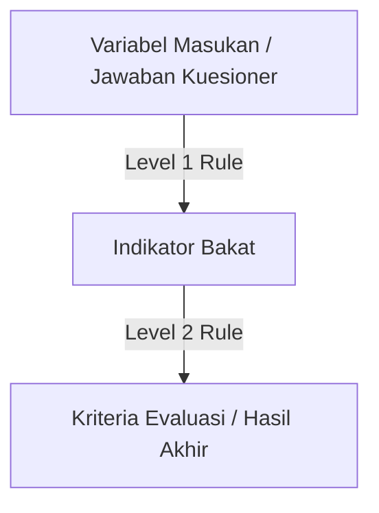

# Panduan Pengguna dan Tutorial Konfigurasi Aturan TalentaKu

Dokumen ini menyediakan panduan lengkap bagi **Pengguna Publik** dan **Administrator** sistem pakar **TalentaKu**, serta tutorial langkah-demi-langkah tentang cara membuat dan mengonfigurasi aturan sistem pakar baru menggunakan metode *Forward Chaining*.

---

## 📖 Bagian 1: Panduan Pengguna Publik

Aplikasi **TalentaKu** dirancang untuk membantu orang tua mengidentifikasi bakat anak-anak mereka berdasarkan kuesioner terstruktur. Berikut adalah langkah-langkah penggunaan aplikasi untuk publik:

### 1. Registrasi & Login
* **Membuat Akun Baru:** Masuk ke halaman **Daftar**, masukkan nama lengkap, email, password, dan konfirmasi password. Anda juga dapat mendaftar dengan sekali klik menggunakan akun **Google**.
* **Masuk ke Aplikasi:** Masuk melalui halaman **Login** menggunakan email dan password yang terdaftar atau dengan akun **Google** Anda.

### 2. Memulai Asesmen Baru (*Child Intake*)
* Setelah login, Anda akan diarahkan ke Dashboard Pengguna. Klik tombol **"Mulai Tes Baru"** atau **"Mulai Konsultasi"**.
* **Isi Form Informasi Anak:**
  * **Nama Anak:** Masukkan nama anak Anda.
  * **Usia Anak:** Masukkan usia anak Anda (rentang yang didukung adalah 3 hingga 12 tahun).
  * **Jenis Kelamin:** Pilih laki-laki atau perempuan.
  * **Nama Sekolah/Instansi:** Masukkan sekolah atau institusi tempat anak belajar.
* **Penentuan Kelompok Usia Otomatis:** Sistem akan mengategorikan anak ke salah satu kelompok berikut berdasarkan usianya untuk menyesuaikan jenis pertanyaan:
  * **Batita (Toddler):** Usia 3 tahun.
  * **Prasekolah (Preschool):** Usia 4 - 6 tahun.
  * **SD Awal (Early Elementary):** Usia 7 - 9 tahun.
  * **SD Akhir (Late Elementary):** Usia 10 - 12 tahun.

### 3. Pengisian Kuesioner
* Anda akan disajikan daftar pertanyaan/pernyataan mengenai perilaku dan keterampilan anak sehari-hari.
* **Skala Penilaian (Likert 1-5):** Jawablah setiap pernyataan secara jujur menggunakan skala bintang/pilihan berikut:
  * **1 (Sangat Tidak Sesuai):** Anak tidak pernah menunjukkan perilaku tersebut.
  * **2 (Tidak Sesuai):** Anak jarang menunjukkan perilaku tersebut.
  * **3 (Cukup Sesuai):** Anak kadang-kadang menunjukkan perilaku tersebut.
  * **4 (Sesuai):** Anak sering menunjukkan perilaku tersebut.
  * **5 (Sangat Sesuai):** Anak selalu menunjukkan perilaku tersebut dengan sangat baik.
* Setelah menyelesaikan seluruh pertanyaan, klik tombol **"Kirim Jawaban"** di bagian bawah halaman.

### 4. Membaca Hasil Analisis & Rekomendasi
Setelah jawaban dikirim, sistem pakar akan memproses data menggunakan mesin *forward chaining* dan menampilkan hasil analisis:
* **Persentase Bakat:** Menampilkan persentase kecocokan anak pada masing-masing kriteria bakat (misalnya: *Intelektual Umum, Akademik Khusus, Berpikir Kreatif, Kepemimpinan, Seni, Psikomotorik*).
* **Rekomendasi & Saran:** Memberikan saran aktivitas stimulasi yang dipersonalisasi berdasarkan potensi bakat dominan yang terdeteksi pada anak.
* **Metode Logika (*Trace*):** Orang tua dapat melihat penjelasan logis mengapa suatu bakat terdeteksi (rincian indikator mana saja yang terpenuhi).

### 5. Riwayat Konsultasi
* Kunjungi menu **"Riwayat"** pada navigasi atas untuk melihat semua sesi asesmen yang pernah dilakukan sebelumnya. Anda dapat membuka kembali detail hasil analisis anak kapan saja tanpa perlu mengisi ulang kuesioner.

---

## 🛠️ Bagian 2: Panduan Pengguna Admin

Halaman Admin digunakan oleh pakar atau pengelola sistem untuk memantau data asesmen, mengelola bank soal (variabel), indikator bakat, kriteria penilaian, dan memperbarui aturan keputusan secara dinamis.

### 1. Login Admin
* Masuk ke halaman admin (biasanya di rute `/admin/login` atau melalui tombol khusus).
* Masukkan kredensial administrator default (Email: `admin@talentaku.com`, Password: `admin123`).

### 2. Dashboard Statistik
* Menampilkan jumlah total anak yang diases, total konsultasi, jumlah kriteria bakat terdaftar, dan log aktivitas terbaru.
* Terdapat grafik visualisasi distribusi bakat anak yang terdeteksi untuk mempermudah pemetaan tren bakat dominan.

### 3. Manajemen Database Aturan (Operasi CRUD Lengkap)
Melalui menu **"Aturan & Data"** (Admin Rules Page), admin dapat mengelola 3 entitas utama pendukung keputusan secara penuh:
1. **Variabel Masukan (Questions):** Pertanyaan kuesioner yang disajikan kepada pengguna.
2. **Indikator Bakat (Level 1):** Kemampuan atau aspek spesifik yang diuji (contoh: `I1` - Perbendaharaan kata tinggi).
3. **Kriteria Evaluasi (Level 2):** Kesimpulan bakat akhir yang diperoleh anak (contoh: `K1` - Intelektual Umum), lengkap dengan deskripsi detail dan saran stimulasi bagi orang tua.

#### 💡 Cara Mengubah dan Menghapus Data (Row Hover Actions):
* **Tampilan Bersih (Default):** Tabel data dirancang sangat bersih tanpa tombol aksi yang mengganggu.
* **Memunculkan Aksi:** Cukup dekatkan kursor (*hover*) ke baris tabel yang diinginkan. Tombol aksi bulat akan muncul secara halus di ujung kanan baris:
  * **Edit (Ikon Pensil):** Membuka form edit dalam modal. Kode utama (*primary key*) seperti Kode Variabel, Kode Indikator, dan Kode Kriteria otomatis terkunci untuk menjaga integritas aturan yang sudah terhubung, sementara kolom deskripsi, label, dan kelompok usia dapat diperbarui bebas.
  * **Hapus (Ikon Tempat Sampah):** Menghapus data tersebut secara permanen.
  * **Detail (Ikon Mata - Khusus Kriteria):** Membuka informasi detail kriteria.
* **Modal Konfirmasi Claymorphism:** 
  Tindakan penghapusan akan memicu **Modal Konfirmasi kustom bertema Claymorphism** (bukan dialog bawaan browser yang kaku). Modal ini menampilkan panel asimetris dengan ikon detak peringatan merah di sisi kiri dan tombol konfirmasi di kanan untuk mencegah penghapusan yang tidak disengaja. Penghapusan data variabel/indikator otomatis menghapus data relasi aturan pemetaan terkait di database (*cascading delete logic*).

### 4. Penambahan Kategori Kuesioner Baru secara Mandiri
* Ketika menambah atau mengedit **Variabel Masukan**, Anda tidak lagi dibatasi dengan pilihan kategori K1-K6 yang kaku.
* Kolom **Kategori** sekarang menggunakan input pencarian cerdas (*datalist*). Anda dapat memilih dari daftar kategori yang ada **atau langsung mengetik nama kategori baru sendiri** (contoh: `Naturalist`).
* Kategori baru yang Anda ketik akan langsung terdaftar di database. Sistem secara otomatis mendeteksi kategori unik tersebut dan membuat **tombol filter kategori dinamis baru** di bagian atas tabel variabel secara instan.

### 5. Konfigurasi Ambang Batas (*Likert Threshold*)
* Kunjungi menu **"Pengaturan"**.
* Anda dapat mengubah **Ambang Batas Likert (*Likert Threshold*)**. Nilai default adalah `4`.
* > [!NOTE]
  > Jika threshold diatur ke `4`, maka suatu *Variabel Masukan* dianggap **terpenuhi** (*true*) jika dan hanya jika pengguna memberikan nilai jawaban **4 (Sesuai)** atau **5 (Sangat Sesuai)** pada kuesioner. Nilai di bawah 4 dianggap tidak terpenuhi (*false*).

---

## 📐 Bagian 3: Tutorial Membuat Aturan Baru & Demo Skenario

Sistem pakar TalentaKu menggunakan metode **Forward Chaining** dua tingkat untuk menarik kesimpulan:

* **Aturan Level 1 (L1):** Menghubungkan satu atau beberapa **Variabel Masukan** ke satu **Indikator Bakat**. Indikator dianggap *terpenuhi* jika **semua** variabel masukan terkait bernilai $\ge$ *threshold*.
* **Aturan Level 2 (L2):** Menghubungkan satu atau beberapa **Indikator Bakat** ke satu **Kriteria Evaluasi**. Kriteria bakat tersebut dinyatakan *terdeteksi* pada anak jika **semua** indikator terkait terpenuhi.

---

### 📝 Demo Skenario: Menambahkan Bakat Baru "Kecerdasan Ekologis (Alam)"

Kita ingin menambahkan kriteria bakat baru yaitu **Kecerdasan Ekologis (Alam)** untuk kelompok usia **Prasekolah**.

#### Detail Rancangan Aturan:
1. **Variabel Masukan Baru:**
   * `C100`: "Anak sangat antusias merawat dan menyiram tanaman di rumah."
   * `C101`: "Anak mengenali berbagai jenis hewan dan menunjukkan empati kepada mereka."
2. **Indikator Bakat Baru:**
   * `I100`: "Ketertarikan Tinggi Terhadap Flora dan Fauna."
3. **Kriteria Evaluasi Baru:**
   * `K100`: "Kecerdasan Ekologis (Naturalis)" (Detail deskripsi & saran stimulasi alam terbuka).

---

### Langkah demi Langkah Konfigurasi di Halaman Admin

#### Langkah 1: Masuk ke Menu Aturan & Data
1. Buka halaman **Admin Dashboard** dan pilih menu **"Kelola Aturan"** atau **"Aturan & Data"** pada sidebar/menu utama.

#### Langkah 2: Tambahkan Variabel Masukan Baru (Questions)
1. Scroll ke bagian **Variabel Masukan** atau klik tombol **"Tambah Baru"** di kolom variabel.
2. Di form modal **"Tambah Variabel Masukan"**, isi sebagai berikut:
   * **Kode Variabel:** `C100`
   * **Label Pertanyaan:** "Anak sangat antusias merawat dan menyiram tanaman di rumah."
   * **Kategori:** `Naturalist`
   * **Kelompok Usia:** Pilih `Prasekolah / TK (Preschool)`
3. Klik **"Simpan Variabel"**.
4. Ulangi proses di atas untuk membuat variabel kedua:
   * **Kode Variabel:** `C101`
   * **Label Pertanyaan:** "Anak mengenali berbagai jenis hewan dan menunjukkan empati kepada mereka."
   * **Kategori:** `Naturalist`
   * **Kelompok Usia:** Pilih `Prasekolah / TK (Preschool)`
5. Klik **"Simpan Variabel"**.

#### Langkah 3: Tambahkan Indikator Bakat Baru
1. Scroll ke kolom **Indikator Bakat** atau klik tombol **"Tambah Baru"** di kolom indikator.
2. Di form modal **"Tambah Indikator Bakat"**, isi sebagai berikut:
   * **Kode Indikator:** `I100`
   * **Nama Indikator:** "Ketertarikan Tinggi Terhadap Flora dan Fauna"
   * **Kelompok Usia:** Pilih `Prasekolah / TK (Preschool)`
3. Klik **"Simpan Indikator"**.

#### Langkah 4: Tambahkan Kriteria Evaluasi Baru
1. Scroll ke kolom **Kriteria Evaluasi** atau klik tombol **"Tambah Baru"** di kolom kriteria.
2. Di form modal **"Tambah Kriteria Evaluasi"**, isi sebagai berikut:
   * **Kode Kriteria:** `K100`
   * **Nama Kriteria:** "Kecerdasan Ekologis (Naturalis)"
   * **Deskripsi:** "Kemampuan anak untuk mengenali, mengklasifikasi, dan menghargai elemen alam sekitar termasuk tanaman, hewan, dan cuaca."
   * **Saran Stimulasi:** "Ajak anak berkebun, lakukan petualangan alam bebas di taman, pelihara hewan peliharaan ringan, dan bacakan ensiklopedia tentang flora-fauna."
   * **Kelompok Usia:** Pilih `Prasekolah / TK (Preschool)`
3. Klik **"Simpan Kriteria"**.

#### Langkah 5: Hubungkan Aturan Level 1 (IF C100 AND C101 THEN I100)
1. Di bagian paling atas halaman aturan, klik tombol **"Tambah Aturan Baru"**.
2. Di form modal **"Tambah Aturan Baru"**, pilih:
   * **Level Aturan:** Pilih `L1: Variabel Masukan ➔ Indikator Bakat`
   * **Target Hasil (THEN):** Pilih `I100 - Ketertarikan Tinggi Terhadap Flora dan Fauna`
   * **Kondisi Premis (IF):** Pilih `C100` dari dropdown. Kode `C100` akan masuk ke daftar kondisi terpilih.
   * Pilih lagi `C101` dari dropdown. Kode `C101` sekarang juga berada di daftar kondisi terpilih.
3. Klik **"Simpan Aturan"**.

> [!TIP]
> Sekarang Aturan L1 telah terbuat. Artinya: **IF (Score C100 $\ge$ Threshold) AND (Score C101 $\ge$ Threshold) THEN Indicator I100 = True**.

#### Langkah 6: Hubungkan Aturan Level 2 (IF I100 THEN K100)
1. Klik tombol **"Tambah Aturan Baru"** lagi.
2. Di form modal, pilih:
   * **Level Aturan:** Pilih `L2: Indikator Bakat ➔ Kriteria Evaluasi`
   * **Target Hasil (THEN):** Pilih `K100 - Kecerdasan Ekologis (Naturalis)`
   * **Kondisi Premis (IF):** Pilih `I100` dari dropdown.
3. Klik **"Simpan Aturan"**.

> [!IMPORTANT]
> Sekarang Aturan L2 telah terbentuk. Artinya: **IF (I100 = True) THEN (Kecerdasan Ekologis K100 Terdeteksi = True)**.

---

### H. Simulasi dan Pengujian Aturan Baru

Untuk memastikan aturan yang Anda buat sudah benar sebelum digunakan secara langsung oleh pengguna publik, Anda dapat mencobanya menggunakan **Simulator Aturan** yang ada di bagian bawah Halaman Admin:

1. Masuk ke halaman **Simulator Aturan** (terintegrasi di halaman Aturan Admin).
2. Tentukan **Nilai Simulasi (1-5)** untuk variabel baru Anda:
   * Skenario Sukses: Berikan skor `5` untuk `C100` dan skor `4` untuk `C101`.
   * Skenario Gagal: Berikan skor `5` untuk `C100` dan skor `2` untuk `C101`.
3. Klik tombol **"Jalankan Simulasi"**.
4. **Periksa Output Hasil:**
   * Pada Skenario Sukses, Anda akan melihat status **`K100 - Kecerdasan Ekologis (Naturalis): TERPENUHI (100.00%)`**. Trace log akan menunjukkan tanda centang hijau pada semua indikator pendukungnya.
   * Pada Skenario Gagal, Anda akan melihat status **`K100 - Kecerdasan Ekologis (Naturalis): TIDAK TERPENUHI (50.00%)`** karena salah satu indikator masukan (`C101` bernilai `2`, di bawah threshold `4`) tidak tercapai.
