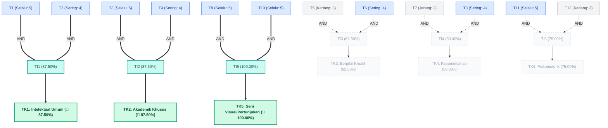

# Demo Simulasi Inferensi Forward Chaining - Batita (Usia 3 Tahun)

Dokumen ini berisi simulasi penelusuran (trace) inferensi *Forward Chaining* secara langkah demi langkah (*step-by-step*) untuk data input uji coba anak usia 3 tahun (Batita). Demonstrasi ini ditujukan untuk memverifikasi akurasi matematis dan logis dari mesin inferensi **TalentaKu** pada kelompok umur termuda.

---

## 1. Profil Anak (Studi Kasus)
* **Nama**: Rian
* **Usia**: 3 Tahun (Kelompok Batita)
* **Kategori Soal**: Variabel T1 s.d T12

---

## 2. Input Data Asesmen (Fakta Awal)
Berikut adalah jawaban skala Likert (1 - 5) yang diberikan oleh orang tua Rian untuk masing-masing gejala perilaku:

| Kode Variabel | Deskripsi Perilaku Teramati | Skor Likert (1-5) |
| :---: | :--- | :---: |
| **T1** | Dapat menyebutkan namanya sendiri dan menunjuk anggota tubuhnya | **5** (Selalu) |
| **T2** | Dapat meniru kata-kata baru yang didengarnya | **4** (Sering) |
| **T3** | Dapat menghitung secara verbal 1-3 benda secara runtut | **5** (Selalu) |
| **T4** | Mengenal warna dasar (merah, biru, kuning) | **4** (Sering) |
| **T5** | Suka mencoret-coret kertas secara bebas | **3** (Kadang) |
| **T6** | Suka bermain pura-pura (*pretend play*) sederhana dengan mainannya | **4** (Sering) |
| **T7** | Mau menunjukkan empati (misal memeluk temannya yang menangis) | **2** (Jarang) |
| **T8** | Mau mengikuti petunjuk sederhana satu langkah (misal: ambil mainan) | **4** (Sering) |
| **T9** | Suka bertepuk tangan atau bergoyang saat mendengar lagu anak | **5** (Selalu) |
| **T10** | Tertarik mencoba memukul mainan yang berbunyi/musik | **5** (Selalu) |
| **T11** | Bisa berlari tanpa sering terjatuh | **5** (Selalu) |
| **T12** | Bisa memegang krayon dengan genggaman tangannya untuk mencoret | **3** (Kadang) |

---

## 3. Langkah-Langkah Inferensi

### Langkah 1: Konversi Biner (Binarization)
Mesin inferensi menerapkan ambang batas (threshold) $\ge 4$ untuk menyatakan suatu fakta bernilai **TRUE**.
* **T1** (Skor 5) $\ge 4 \rightarrow$ **TRUE**
* **T2** (Skor 4) $\ge 4 \rightarrow$ **TRUE**
* **T3** (Skor 5) $\ge 4 \rightarrow$ **TRUE**
* **T4** (Skor 4) $\ge 4 \rightarrow$ **TRUE**
* **T5** (Skor 3) $< 4 \rightarrow$ **FALSE**
* **T6** (Skor 4) $\ge 4 \rightarrow$ **TRUE**
* **T7** (Skor 2) $< 4 \rightarrow$ **FALSE**
* **T8** (Skor 4) $\ge 4 \rightarrow$ **TRUE**
* **T9** (Skor 5) $\ge 4 \rightarrow$ **TRUE**
* **T10** (Skor 5) $\ge 4 \rightarrow$ **TRUE**
* **T11** (Skor 5) $\ge 4 \rightarrow$ **TRUE**
* **T12** (Skor 3) $< 4 \rightarrow$ **FALSE**

---

### Langkah 2: Evaluasi Level 1 (Variabel $\rightarrow$ Indikator)
Menghitung persentase skor indikator dan menentukan status keaktifannya menggunakan logika **AND** dari variabel penyusunnya.

#### 1. TI1: Kemampuan Komunikasi & Bicara Dasar (T1 & T2)
* **Status Aturan**: `T1 (TRUE) AND T2 (TRUE)` $\rightarrow$ **TI1 = TRUE (Terpenuhi)**
* **Kalkulasi Persentase**: 
  $$\text{Rata-rata Skor} = \frac{5 + 4}{2} = 4.5$$
  $$\text{Persentase} = \frac{4.5 - 1.0}{4.0} \times 100\% = 87.50\%$$

#### 2. TI2: Konsep Angka & Warna Dasar (T3 & T4)
* **Status Aturan**: `T3 (TRUE) AND T4 (TRUE)` $\rightarrow$ **TI2 = TRUE (Terpenuhi)**
* **Kalkulasi Persentase**: 
  $$\text{Rata-rata Skor} = \frac{5 + 4}{2} = 4.5$$
  $$\text{Persentase} = \frac{4.5 - 1.0}{4.0} \times 100\% = 87.50\%$$

#### 3. TI3: Imajinasi Bermain Toddler (T5 & T6)
* **Status Aturan**: `T5 (FALSE) AND T6 (TRUE)` $\rightarrow$ **TI3 = FALSE (Tidak Terpenuhi)**
* **Kalkulasi Persentase**: 
  $$\text{Rata-rata Skor} = \frac{3 + 4}{2} = 3.5$$
  $$\text{Persentase} = \frac{3.5 - 1.0}{4.0} \times 100\% = 62.50\%$$

#### 4. TI4: Kepatuhan & Sosialisasi Dasar (T7 & T8)
* **Status Aturan**: `T7 (FALSE) AND T8 (TRUE)` $\rightarrow$ **TI4 = FALSE (Tidak Terpenuhi)**
* **Kalkulasi Persentase**: 
  $$\text{Rata-rata Skor} = \frac{2 + 4}{2} = 3.0$$
  $$\text{Persentase} = \frac{3.0 - 1.0}{4.0} \times 100\% = 50.00\%$$

#### 5. TI5: Respon Musik & Estetika Toddler (T9 & T10)
* **Status Aturan**: `T9 (TRUE) AND T10 (TRUE)` $\rightarrow$ **TI5 = TRUE (Terpenuhi)**
* **Kalkulasi Persentase**: 
  $$\text{Rata-rata Skor} = \frac{5 + 5}{2} = 5.0$$
  $$\text{Persentase} = \frac{5.0 - 1.0}{4.0} \times 100\% = 100.00\%$$

#### 6. TI6: Keterampilan Motorik Toddler (T11 & T12)
* **Status Aturan**: `T11 (TRUE) AND T12 (FALSE)` $\rightarrow$ **TI6 = FALSE (Tidak Terpenuhi)**
* **Kalkulasi Persentase**: 
  $$\text{Rata-rata Skor} = \frac{5 + 3}{2} = 4.0$$
  $$\text{Persentase} = \frac{4.0 - 1.0}{4.0} \times 100\% = 75.00\%$$

---

### Langkah 3: Evaluasi Level 2 (Indikator $\rightarrow$ Kriteria Bakat)
Menentukan status terpenuhinya kriteria bakat (solusi) secara biner dan menetapkan skor akhirnya. Pada kelompok Batita, setiap kriteria hanya memiliki 1 indikator pendukung, sehingga persentase kriteria sama dengan persentase indikatornya.

| Kode Kriteria | Nama Kriteria Bakat | Aturan Level 2 | Status Aturan | Skor Akhir |
| :---: | :--- | :--- | :---: | :---: |
| **TK1** | Intelektual Umum | `IF TI1` | **Rule True** (Terpenuhi) | **87.50%** |
| **TK2** | Akademik Khusus | `IF TI2` | **Rule True** (Terpenuhi) | **87.50%** |
| **TK3** | Berpikir Kreatif & Produktif | `IF TI3` | **Rule False** (Tidak Terpenuhi) | **62.50%** |
| **TK4** | Kepemimpinan | `IF TI4` | **Rule False** (Tidak Terpenuhi) | **50.00%** |
| **TK5** | Seni Visual & Pertunjukan | `IF TI5` | **Rule True** (Terpenuhi) | **100.00%** |
| **TK6** | Psikomotorik | `IF TI6` | **Rule False** (Tidak Terpenuhi) | **75.00%** |

---

## 4. Hasil Analisis Akhir (Output Dashboard)

Sistem akan mengurutkan kriteria berdasarkan skor persentase kecocokan tertinggi untuk mendapatkan **Top-3 Bakat**:

### 1. Peringkat 🥇: TK5 - Seni Visual dan Pertunjukan (100.00% - Terpenuhi)
* **Deskripsi**: Kepekaan dasar anak terhadap irama musik dan gambar berwarna.
* **Saran Pengembangan**: Putar musik anak-anak dan ajak bergoyang/bertepuk tangan bersama, sediakan buku bergambar besar.

### 2. Peringkat 🥈: TK1 - Intelektual Umum (87.50% - Terpenuhi)
* **Deskripsi**: Kemampuan komunikasi dan memori dasar pada anak usia 3 tahun.
* **Saran Pengembangan**: Dukung dengan membacakan buku bergambar, bernyanyi bersama, dan merespons celoteh anak dengan kalimat lengkap.

### 3. Peringkat 🥉: TK2 - Akademik Khusus (87.50% - Terpenuhi)
* **Deskripsi**: Kemampuan mengenal konsep angka dasar (1-3) dan bentuk/warna dasar.
* **Saran Pengembangan**: Ajak bermain puzzle balok sederhana, menyebutkan warna mainan, dan berhitung jari.

---

## 5. Graf Jalur Eksekusi Inferensi (Mermaid)

Di bawah ini adalah representasi visual dari graf jalur inferensi Rian. Garis tebal dengan panah hijau menunjukkan jalur aturan yang berhasil terpenuhi (`True`), sedangkan garis putus-putus abu-abu menunjukkan jalur aturan yang tidak terpenuhi (`False`).

