# Rancangan Sistem Pakar Penentuan Bakat Anak - TalentaKu

Dokumen ini menjelaskan rancangan arsitektur basis pengetahuan (*knowledge base*), data kondisi/gejala (variabel), data solusi (kriteria), dan aturan inferensi (*rule*) yang diterapkan dalam sistem pakar **TalentaKu** menggunakan metode **Forward Chaining**.

---

## A. Identifikasi Kebutuhan Data Kondisi atau Gejala (Variabel)

Data kondisi atau gejala dalam sistem ini merupakan indikator perilaku teramati pada anak (*behavioral observations*). Gejala-gejala ini dipetakan berdasarkan **4 kelompok usia** untuk menyesuaikan dengan tahap tumbuh kembang anak.

Setiap gejala dinilai menggunakan **Skala Likert 5 Poin**:
1. **Tidak Pernah** (Skor 1)
2. **Jarang** (Skor 2)
3. **Kadang** (Skor 3)
4. **Sering** (Skor 4)
5. **Selalu** (Skor 5)

Pada mesin inferensi, nilai jawaban dikonversi menjadi biner (`True` / `False`) menggunakan nilai ambang batas (*threshold*), dengan nilai bawaan **$\ge 4$** (artinya perilaku tersebut "Sering" atau "Selalu" ditunjukkan oleh anak).

### Ringkasan Jumlah Gejala per Kelompok Usia

| Kelompok Usia | Rentang Usia | Kode Variabel | Jumlah Variabel (Gejala) |
| :--- | :--- | :--- | :--- |
| **Batita** | 3 Tahun | `T1` s.d `T12` | 12 Gejala |
| **Prasekolah / TK** | 4 - 6 Tahun | `C1` s.d `C83` | 83 Gejala (Basis Jurnal Sumber) |
| **SD Awal** | 7 - 9 Tahun | `E1` s.d `E24` | 24 Gejala |
| **SD Akhir** | 10 - 12 Tahun | `L1` s.d `L24` | 24 Gejala |

<b>1. Daftar Gejala Batita (Usia 3 Tahun)</b>

| Kode | Pertanyaan / Indikator Gejala Teramati | Kategori Asal |
| :--- | :--- | :--- |
| **T1** | Dapat menyebutkan namanya sendiri dan menunjuk anggota tubuhnya | Intelektual Umum |
| **T2** | Dapat meniru kata-kata baru yang didengarnya | Intelektual Umum |
| **T3** | Dapat menghitung secara verbal 1-3 benda secara runtut | Akademik Khusus |
| **T4** | Mengenal warna dasar (merah, biru, kuning) | Akademik Khusus |
| **T5** | Suka mencoret-coret kertas secara bebas | Berpikir Kreatif |
| **T6** | Suka bermain pura-pura (*pretend play*) sederhana dengan mainannya | Berpikir Kreatif |
| **T7** | Mau menunjukkan empati (misal memeluk temannya yang menangis) | Kepemimpinan |
| **T8** | Mau mengikuti petunjuk sederhana satu langkah (misal: ambil mainan) | Kepemimpinan |
| **T9** | Suka bertepuk tangan atau bergoyang saat mendengar lagu anak | Seni Visual & Pertunjukan |
| **T10** | Tertarik mencoba memukul mainan yang berbunyi/musik | Seni Visual & Pertunjukan |
| **T11** | Bisa berlari tanpa sering terjatuh | Psikomotorik |
| **T12** | Bisa memegang krayon dengan genggaman tangannya untuk mencoret | Psikomotorik |

<b>2. Daftar Gejala Prasekolah / TK (Usia 4-6 Tahun)</b>

| Kode | Pertanyaan / Indikator Gejala Teramati | Kategori Asal |
| :--- | :--- | :--- |
| **C1** | Dapat menirukan kalimat sederhana dengan jelas | Intelektual Umum |
| **C2** | Dapat meniru kembali 4-5 urutan kata yang didengar | Intelektual Umum |
| **C3** | Mengulangi kalimat panjang yang baru saja didengarnya secara presisi | Intelektual Umum |
| **C4** | Menyanyikan lagu anak-anak lebih dari 20 lagu yang berbeda | Intelektual Umum |
| **C5** | Dapat menyebutkan simbol-simbol huruf vokal dan konsonan yang ditunjuk | Intelektual Umum |
| **C6** | Mengucapkan syair lagu secara lantang sambil bersenandung mengikuti irama | Intelektual Umum |
| **C7** | Dapat mengelompokkan benda-benda sekitar berdasarkan kesamaan fungsinya | Intelektual Umum |
| **C8** | Meniru penulisan berbagai lambang huruf vokal dan konsonan di atas kertas | Intelektual Umum |
| **C9** | Mengelompokkan peralatan makan, mandi, dan kebersihan secara terpisah | Intelektual Umum |
| **C10** | Menggunakan kata tanya (apa, mengapa, dimana, berapa, bagaimana) dengan tepat | Intelektual Umum |
| **C11** | Bercerita secara runtut tentang gambar yang disediakan atau buatannya sendiri | Intelektual Umum |
| **C12** | Aktif menggunakan kata ganti orang (aku, saya, kamu, mereka) dalam bercakap | Intelektual Umum |
| **C13** | Menceritakan kembali pengalaman menarik atau kejadian sederhana yang dialaminya | Intelektual Umum |
| **C14** | Memberikan keterangan lengkap atau informasi spontan tentang suatu hal | Intelektual Umum |
| **C15** | Dapat menyebutkan urutan bilangan 1 sampai 10 secara runtut | Akademik Khusus |
| **C16** | Dapat menunjuk lambang bilangan 1 sampai 10 yang ditulis acak | Akademik Khusus |
| **C17** | Meniru penulisan lambang bilangan 1 sampai 10 | Akademik Khusus |
| **C18** | Mengenal dan menyebutkan lambang bilangan 1 sampai 20 | Akademik Khusus |
| **C19** | Membedakan dan membentuk dua kumpulan benda berdasarkan jumlah kuantitasnya | Akademik Khusus |
| **C20** | Mengenal perbedaan bentuk geometri benda (bulat, segitiga, kotak) | Akademik Khusus |
| **C21** | Mencoba mencampur warna cat dan antusias menceritakan perubahan warnanya | Akademik Khusus |
| **C22** | Suka bereksperimen menaruh benda ke air lalu menceritakan peristiwa tenggelam/terapung | Akademik Khusus |
| **C23** | Menirukan dan menceritakan macam-macam bunyi alam atau kendaraan sekitar | Akademik Khusus |
| **C24** | Mengenali dan menceritakan perbedaan macam-macam rasa makanan (manis, pahit, dll) | Akademik Khusus |
| **C25** | Menceritakan berbagai jenis bau wewangian atau bau tak sedap secara spesifik | Akademik Khusus |
| **C26** | Mau mengungkapkan pendapat pribadinya secara sederhana dalam diskusi | Berpikir Kreatif |
| **C27** | Menjawab pertanyaan dengan antusias ketika dimintai informasi atau keterangan | Berpikir Kreatif |
| **C28** | Spontan menyapa teman sebaya maupun orang dewasa yang dikenalnya | Berpikir Kreatif |
| **C29** | Mengucapkan salam saat masuk ruangan atau bertemu orang lain | Berpikir Kreatif |
| **C30** | Mengucapkan terima kasih secara sadar setelah menerima sesuatu | Berpikir Kreatif |
| **C31** | Mengekspresikan perasaannya (marah, sedih, gembira, cemas) secara wajar | Berpikir Kreatif |
| **C32** | Membuat perencanaan sederhana mengenai aktivitas bermain yang ingin dilakukannya | Berpikir Kreatif |
| **C33** | Mampu mengambil keputusan sederhana (misalnya memilih mainan atau pakaian sendiri) | Berpikir Kreatif |
| **C34** | Menggambar secara bebas dan ekspresif menggunakan krayon/spidol | Berpikir Kreatif |
| **C35** | Mampu membedakan perbuatan yang benar dan yang salah di lingkungannya | Berpikir Kreatif |
| **C36** | Suka menolong teman yang mengalami kesulitan atau terjatuh | Berpikir Kreatif |
| **C37** | Mau bermain dengan siapa saja tanpa membedakan latar belakang/perbedaan fisik | Berpikir Kreatif |
| **C38** | Menghargai hasil gambar atau susunan balok karya temannya | Berpikir Kreatif |
| **C39** | Mengakui dan memuji keunggulan atau kemampuan yang dimiliki temannya | Berpikir Kreatif |
| **C40** | Menginisiasi permainan dengan mengajak teman-teman sekitar bergabung | Berpikir Kreatif |
| **C41** | Mudahan memberi maaf kepada teman yang tidak sengaja merusaknya/menyakitinya | Berpikir Kreatif |
| **C42** | Dapat berinteraksi ramah dengan teman yang berbeda agama/keyakinan | Berpikir Kreatif |
| **C43** | Memberikan pujian verbal kepada teman yang berbuat baik atau berhasil | Berpikir Kreatif |
| **C44** | Berpakaian rapi dan menjaga kesopanan selama berada di sekolah/tempat umum | Berpikir Kreatif |
| **C45** | Menghormati guru, orang tua, dan orang yang berusia lebih tua | Berpikir Kreatif |
| **C46** | Mendengarkan dengan tenang ketika guru atau temannya sedang berbicara | Berpikir Kreatif |
| **C47** | Menjaga dan memelihara hasil karyanya sendiri agar tidak rusak | Berpikir Kreatif |
| **C48** | Mentaati aturan dan kesepakatan dalam permainan bersama teman | Berpikir Kreatif |
| **C49** | Berani mengajukan pertanyaan kritis dan menjawab pertanyaan guru di kelas | Kepemimpinan |
| **C50** | Bertanggung jawab merapikan mainan atau menyelesaikan tugas pribadinya | Kepemimpinan |
| **C51** | Fokus menyelesaikan tugas mandirinya dari awal sampai tuntas tanpa menyerah | Kepemimpinan |
| **C52** | Melaksanakan 3-5 perintah berurutan dengan benar | Kepemimpinan |
| **C53** | Dapat membagi peran dan menyelesaikan tugas kelompok dengan gembira | Kepemimpinan |
| **C54** | Dapat bekerja sama secara aktif dengan teman sebayanya dalam tim | Kepemimpinan |
| **C55** | Senang berinteraksi sosial dan bergaul dengan lingkungan baru | Kepemimpinan |
| **C56** | Inisiatif membantu teman kelompoknya yang tertinggal dalam aktivitas kelas | Kepemimpinan |
| **C57** | Menengahi dan mau membantu meredakan perselisihan di antara teman bermainnya | Kepemimpinan |
| **C58** | Mau berbagi makanan atau alat tulis secara sukarela kepada teman | Kepemimpinan |
| **C59** | Meminjamkan mainan miliknya kepada teman lain tanpa paksaan | Kepemimpinan |
| **C60** | Sabar mengantre atau menunggu gilirannya saat bermain bersama | Kepemimpinan |
| **C61** | Mengendalikan emosi dengan wajar saat keinginannya tidak terpenuhi | Kepemimpinan |
| **C62** | Menerima saran atau masukan sederhana dari guru/orang tua dengan tenang | Kepemimpinan |
| **C63** | Melukiskan bentuk nyata yang dilihat atau didengarnya dengan proporsi baik | Seni Visual & Pertunjukan |
| **C64** | Mampu menggambar pola gabungan dari titik, garis, lingkaran, dan segitiga | Seni Visual & Pertunjukan |
| **C65** | Dapat membunyikan ketukan teratur pada alat musik anak (xylophone, dll) | Seni Visual & Pertunjukan |
| **C66** | Dapat membedakan bunyi nada tinggi dan rendah dengan tepat | Seni Visual & Pertunjukan |
| **C67** | Menyelaraskan gerakan tubuh secara indah sesuai syair lagu atau musik pengiring | Seni Visual & Pertunjukan |
| **C68** | Menampilkan ekspresi emosi wajah yang teatrikal saat menari atau bercerita | Seni Visual & Pertunjukan |
| **C69** | Bermain peran secara total memerankan karakter tertentu (misal: menjadi dokter/hewan) | Seni Visual & Pertunjukan |
| **C70** | Berjalan, berlari, dan melompat secara seimbang | Psikomotorik |
| **C71** | Melempar dan menangkap bola kecil dengan terarah | Psikomotorik |
| **C72** | Meniti di atas papan titian atau berjalan dengan tumit ke jari kaki | Psikomotorik |
| **C73** | Menggunakan sendok, garpu, dan cangkir minum sendiri dengan rapi | Psikomotorik |
| **C74** | Membuka dan mengancingkan baju atau memakai tali sepatu sendiri | Psikomotorik |
| **C75** | Menyusun balok tinggi atau merangkai puzzle 12+ keping | Psikomotorik |
| **C76** | Melipat kertas menjadi bentuk sederhana seperti lipatan segitiga/amplop | Psikomotorik |
| **C77** | Menggunting kertas mengikuti pola garis lurus, gelombang, atau lingkaran | Psikomotorik |
| **C78** | Membuka dan memutar tutup botol atau toples dengan tangan sendiri | Psikomotorik |
| **C79** | Memutar mur mainan atau merakit komponen mainan bongkar pasang | Psikomotorik |
| **C80** | Memegang alat tulis (pensil/krayon) dengan *tripod grasp* yang benar | Psikomotorik |
| **C81** | Menggunakan palu mainan atau memasukkan pasak kayu ke lubangnya | Psikomotorik |
| **C82** | Berdiri dengan satu kaki selama 5-10 detik secara stabil | Psikomotorik |
| **C83** | Bergantung atau berayun pada palang besi di arena bermain | Psikomotorik |

<b>3. Daftar Gejala SD Awal (Usia 7-9 Tahun)</b>

| Kode | Pertanyaan / Indikator Gejala Teramati | Kategori Asal |
| :--- | :--- | :--- |
| **E1** | Dapat menjelaskan jalan cerita dari buku yang dibacanya | Intelektual Umum |
| **E2** | Memiliki kosakata yang kaya dan mampu menggunakannya dalam kalimat yang benar | Intelektual Umum |
| **E3** | Suka bermain puzzle yang membutuhkan pemikiran logis | Intelektual Umum |
| **E4** | Mampu mengidentifikasi sebab-akibat sederhana dalam kehidupan sehari-hari | Intelektual Umum |
| **E5** | Mampu melakukan penjumlahan dan pengurangan matematika dasar dengan lancar | Akademik Khusus |
| **E6** | Tertarik memecahkan teka-teki angka atau logika matematika | Akademik Khusus |
| **E7** | Suka mengamati serangga, tanaman, atau fenomena alam di sekitar | Akademik Khusus |
| **E8** | Tertarik membaca buku tentang antariksa, dinosaurus, atau tubuh manusia | Akademik Khusus |
| **E9** | Sering menemukan cara baru untuk merakit mainan block/lego | Berpikir Kreatif |
| **E10** | Suka mengarang cerita imajinatif atau membuat gambar komik sederhana | Berpikir Kreatif |
| **E11** | Mampu menemukan solusi alternatif saat mainannya rusak | Berpikir Kreatif |
| **E12** | Menunjukkan minat tinggi pada kegiatan kerajinan tangan (*crafting*) | Berpikir Kreatif |
| **E13** | Mampu memimpin kelompok kecil dalam permainan atau tugas sekolah | Kepemimpinan |
| **E14** | Mengalah demi kepentingan bersama saat bermain dengan teman | Kepemimpinan |
| **E15** | Mampu menyiapkan perlengkapan sekolahnya sendiri setiap hari | Kepemimpinan |
| **E16** | Menyelesaikan tugas pekerjaan rumah (PR) tepat waktu secara mandiri | Kepemimpinan |
| **E17** | Mampu menggambar objek dengan detail yang cukup baik (proporsi/bayangan) | Seni Visual & Pertunjukan |
| **E18** | Suka mewarnai dengan kombinasi warna yang harmonis | Seni Visual & Pertunjukan |
| **E19** | Mampu menyanyikan lagu dengan nada yang tepat (*pitch control*) | Seni Visual & Pertunjukan |
| **E20** | Percaya diri tampil menari atau menyanyi di depan kelas/keluarga | Seni Visual & Pertunjukan |
| **E21** | Lancar mengendarai sepeda roda dua tanpa bantuan roda samping | Psikomotorik |
| **E22** | Mampu melakukan lompat tali (*skipping*) beberapa kali berturut-turut | Psikomotorik |
| **E23** | Mampu menggunakan gunting dengan rapi untuk memotong pola yang rumit | Psikomotorik |
| **E24** | Dapat meronce manik-manik kecil atau melipat kertas origami dengan rapi | Psikomotorik |

<b>4. Daftar Gejala SD Akhir (Usia 10-12 Tahun)</b>

| Kode | Pertanyaan / Indikator Gejala Teramati | Kategori Asal |
| :--- | :--- | :--- |
| **L1** | Mampu memahami konsep abstrak (keadilan, toleransi, ekonomi dasar) | Intelektual Umum |
| **L2** | Suka berdebat secara logis mengenai suatu topik dengan orang tua/guru | Intelektual Umum |
| **L3** | Suka membaca novel anak atau artikel pengetahuan yang panjang | Intelektual Umum |
| **L4** | Mampu menulis karangan atau esai pendek dengan alur pemikiran yang runtut | Intelektual Umum |
| **L5** | Cepat memahami materi matematika kompleks (pecahan desimal, bangun ruang) | Akademik Khusus |
| **L6** | Mampu membaca dan membuat grafik atau tabel sederhana secara mandiri | Akademik Khusus |
| **L7** | Suka melakukan eksperimen sains sekolah dan antusias mencatat hasilnya | Akademik Khusus |
| **L8** | Tertarik pada teknologi baru, pemrograman komputer dasar, atau robotik | Akademik Khusus |
| **L9** | Suka mendesain sesuatu (poster digital, maket rumah, pakaian boneka) | Berpikir Kreatif |
| **L10** | Sering memberikan ide-ide orisinal dalam proyek kelompok sekolah | Berpikir Kreatif |
| **L11** | Suka mengapresiasi karya seni, musik klasik, atau film dengan ulasan kritis | Berpikir Kreatif |
| **L12** | Tertarik mempelajari budaya, bahasa, atau sejarah daerah/negara lain | Berpikir Kreatif |
| **L13** | Sering ditunjuk atau bersedia menjadi ketua kelas atau pemimpin kelompok | Kepemimpinan |
| **L14** | Mampu mengorganisir teman-teman untuk menyelesaikan proyek kelompok | Kepemimpinan |
| **L15** | Mampu menerima kegagalan dalam lomba dengan sikap sportif dan positif | Kepemimpinan |
| **L16** | Mampu membantu menyelesaikan perselisihan antara teman secara adil | Kepemimpinan |
| **L17** | Mampu membuat lukisan/karya 3D dengan teknik dan arsiran yang baik | Seni Visual & Pertunjukan |
| **L18** | Mahir menggunakan media digital untuk menggambar atau mengedit foto/video | Seni Visual & Pertunjukan |
| **L19** | Bisa memainkan satu alat musik dengan baik (gitar, keyboard, biola, dll) | Seni Visual & Pertunjukan |
| **L20** | Mampu menciptakan gerakan tari atau melodi lagu sederhana sendiri | Seni Visual & Pertunjukan |
| **L21** | Menguasai teknik dasar olahraga tim (sepak bola, basket, bulu tangkis) | Psikomotorik |
| **L22** | Memiliki kelincahan, kekuatan, dan daya tahan fisik yang menonjol | Psikomotorik |
| **L23** | Suka membongkar dan memperbaiki mainan mekanik atau barang elektronik | Psikomotorik |
| **L24** | Memiliki ketelitian tinggi dalam menjahit, merakit model miniatur, dll | Psikomotorik |

---

## B. Identifikasi Kebutuhan Data Solusi atau Tawaran (Kriteria Bakat)

Hasil akhir (solusi) dari sistem pakar ini dikelompokkan ke dalam **6 Kriteria Bakat Utama** berdasarkan standar USOE (*US Office of Education*). Kriteria-kriteria ini berlaku untuk semua jenjang usia dengan tingkat kedalaman deskripsi dan saran pengembangan yang disesuaikan.

### 6 Kriteria Bakat Utama

| Kode Kriteria | Nama Kriteria Bakat | Deskripsi Singkat Sistem |
| :---: | :--- | :--- |
| **K1 / TK1 / EK1 / LK1** | **Intelektual Umum** | Kemampuan intelektual menyeluruh, mencakup daya tangkap verbal yang tinggi, memori kuat, dan abstraksi kata. |
| **K2 / TK2 / EK2 / LK2** | **Akademik Khusus** | Penguasaan menonjol pada bidang sains anak usia dini, logika numerik dasar, atau matematika sekolah. |
| **K3 / TK3 / EK3 / LK3** | **Berpikir Kreatif & Produktif** | Kemampuan melahirkan ide unik/orisinal, empati sosial yang tinggi, dan kemandirian berkarya. |
| **K4 / TK4 / EK4 / LK4** | **Kepemimpinan** | Kecakapan mengorganisasi teman, bersikap kooperatif, bertanggung jawab, dan mengelola konflik. |
| **K5 / TK5 / EK5 / LK5** | **Seni Visual & Pertunjukan** | Kepekaan tinggi pada aspek estetika visual (menggambar/melukis), musik (nada/ritme), serta seni gerak/drama. |
| **K6 / TK6 / EK6 / LK6** | **Psikomotorik** | Kematangan fisik yang mencakup keseimbangan motorik kasar serta ketelitian motorik halus/mekanik. |

Setiap hasil asesmen memberikan solusi berupa **Top-3 Bakat Teratas** (berdasarkan skor persentase kecocokan tertinggi) lengkap dengan deskripsi naratif dan rekomendasi aktivitas pengasuhan/pendidikan yang aplikatif (*Suggestions*).

---

## C. Identifikasi Kebutuhan Data Rule (Aturan Inferensi)

Mesin inferensi sistem pakar **TalentaKu** menggunakan logika **Forward Chaining** dua tingkat:
1. **Level 1 (Variabel $\rightarrow$ Indikator)**:
   Mengevaluasi apakah indikator tertentu terpenuhi (`True`). Sebuah indikator terpenuhi jika dan hanya jika **seluruh variabel penyusunnya** bernilai `True` (memenuhi threshold skala Likert $\ge 4$).
2. **Level 2 (Indikator $\rightarrow$ Kriteria Bakat)**:
   Menguji aturan basis pengetahuan untuk mengaktifkan kriteria bakat. Aturan menggunakan operator logika **AND** antar-indikator.

### Aturan Tingkat 1 (Variabel ke Indikator)

Aturan ini mengelompokkan gejala dasar ke dalam konsep indikator psikometrik.

#### 1. Kelompok Batita (Usia 3 Tahun)
* `TI1` (Kemampuan Komunikasi & Bicara Dasar) $\leftarrow$ `T1` **AND** `T2`
* `TI2` (Konsep Angka & Warna Dasar) $\leftarrow$ `T3` **AND** `T4`
* `TI3` (Imajinasi Bermain Toddler) $\leftarrow$ `T5` **AND** `T6`
* `TI4` (Kepatuhan & Sosialisasi Dasar) $\leftarrow$ `T7` **AND** `T8`
* `TI5` (Respon Musik & Estetika Toddler) $\leftarrow$ `T9` **AND** `T10`
* `TI6` (Keterampilan Motorik Toddler) $\leftarrow$ `T11` **AND** `T12`

#### 2. Kelompok Prasekolah / TK (Usia 4-6 Tahun) - *Basis Jurnal*
* **Intelektual Umum**:
  * `I1` (Perbendaharaan kata tinggi) $\leftarrow$ `C1` **AND** `C2` **AND** `C3`
  * `I2` (Ingatan kuat) $\leftarrow$ `C4` **AND** `C5` **AND** `C6` **AND** `C7` **AND** `C8` **AND** `C9`
  * `I3` (Penguasaan kata abstrak) $\leftarrow$ `C10` **AND** `C11` **AND** `C12` **AND** `C13` **AND** `C14`
* **Akademik Khusus**:
  * `I4` (Pemikiran abstrak) $\leftarrow$ `C15` **AND** `C16` **AND** `C17` **AND** `C18`
  * `I5` (Prestasi matematika) $\leftarrow$ `C19` **AND** `C20` **AND** `C21` **AND** `C22` **AND** `C23` **AND** `C24` **AND** `C25`
* **Berpikir Kreatif**:
  * `I6` (Prestasi sains/Keingintahuan) $\leftarrow$ `C26` **AND** `C27`
  * `I7` (Keterbukaan terhadap pengalaman) $\leftarrow$ `C28` **AND** `C29` **AND** `C30` **AND** `C31` **AND** `C32`
  * `I8` (Standar personal) $\leftarrow$ `C33` **AND** `C34`
  * `I9` (Memainkan ide) $\leftarrow$ `C35` **AND** `C36`
  * `I10` (Menghadapi resiko) $\leftarrow$ `C37` **AND** `C38` **AND** `C39` **AND** `C40`
  * `I11` (Kesukaan terhadap kompleksitas) $\leftarrow$ `C41` **AND** `C42` **AND** `C43`
  * `I12` (Toleran ambiguitas) $\leftarrow$ `C44` **AND** `C45` **AND** `C46`
  * `I13` (Image diri positif) $\leftarrow$ `C47` **AND** `C48`
* **Kepemimpinan**:
  * `I14` (Menyatu dengan tugas) $\leftarrow$ `C49` **AND** `C50`
  * `I15` (Kepercayaan diri) $\leftarrow$ `C51` **AND** `C52`
  * `I16` (Tanggung jawab) $\leftarrow$ `C53` **AND** `C54` **AND** `C55` **AND** `C56` **AND** `C57`
  * `I17` (Kerja sama) $\leftarrow$ `C58` **AND** `C59`
  * `I18` (Mendominasi/Menggerakkan) $\leftarrow$ `C60` **AND** `C61` **AND** `C62`
* **Seni Visual & Pertunjukan**:
  * `I19` (Adaptasi situasi baru) $\leftarrow$ `C63` **AND** `C64`
  * `I20` (Seni visual) $\leftarrow$ `C65` **AND** `C66`
  * `I21` (Seni musik) $\leftarrow$ `C67` **AND** `C68`
  * `I22` (Drama) $\leftarrow$ `C69`
* **Psikomotorik**:
  * `I23` (Motorik kinestetik) $\leftarrow$ `C70` **AND** `C71` **AND** `C72`
  * `I24` (Keterampilan praktik) $\leftarrow$ `C73` **AND** `C74`
  * `I25` (Spasial) $\leftarrow$ `C75` **AND** `C76` **AND** `C77`
  * `I26` (Mekanika) $\leftarrow$ `C78` **AND** `C79` **AND** `C80` **AND** `C81`
  * `I27` (Fisikal) $\leftarrow$ `C82` **AND** `C83`

#### 3. Kelompok SD Awal (Usia 7-9 Tahun)
* `EI1` (Kemampuan Verbal & Pemahaman Cerita) $\leftarrow$ `E1` **AND** `E2`
* `EI2` (Penalaran Logis & Analitis Awal) $\leftarrow$ `E3` **AND** `E4`
* `EI3` (Keterampilan Matematika Dasar) $\leftarrow$ `E5` **AND** `E6`
* `EI4` (Minat Observasi Alam & Sains) $\leftarrow$ `E7` **AND** `E8`
* `EI5` (Orisinalitas & Pembuatan Karya) $\leftarrow$ `E9` **AND** `E10`
* `EI6` (Pemecahan Masalah & Kreativitas Praktis) $\leftarrow$ `E11` **AND** `E12`
* `EI7` (Kepemimpinan & Kerjasama Kelompok) $\leftarrow$ `E13` **AND** `E14`
* `EI8` (Kemandirian & Tanggung Jawab Akademik) $\leftarrow$ `E15` **AND** `E16`
* `EI9` (Menggambar dengan Detail & Proporsi) $\leftarrow$ `E17` **AND** `E18`
* `EI10` (Bakat Musik & Keberanian Tampil) $\leftarrow$ `E19` **AND** `E20`
* `EI11` (Keseimbangan & Kelincahan Fisik) $\leftarrow$ `E21` **AND** `E22`
* `EI12` (Keterampilan Motorik Halus Presisi) $\leftarrow$ `E23` **AND** `E24`

#### 4. Kelompok SD Akhir (Usia 10-12 Tahun)
* `LI1` (Penalaran Abstrak & Debat Logis) $\leftarrow$ `L1` **AND** `L2`
* `LI2` (Literasi Karangan & Menulis Runtut) $\leftarrow$ `L3` **AND** `L4`
* `LI3` (Keterampilan Matematika Lanjut) $\leftarrow$ `L5` **AND** `L6`
* `LI4` (Eksperimen Sains & Minat Teknologi) $\leftarrow$ `L7` **AND** `L8`
* `LI5` (Inovasi Desain & Proyek Mandiri) $\leftarrow$ `L9` **AND** `L10`
* `LI6` (Apresiasi Estetika & Budaya Kritis) $\leftarrow$ `L11` **AND** `L12`
* `LI7` (Kepemimpinan Kelompok & Organisasi) $\leftarrow$ `L13` **AND** `L14`
* `LI8` (Sportivitas & Resolusi Konflik Sebaya) $\leftarrow$ `L15` **AND** `L16`
* `LI9` (Seni Rupa & Media Digital Lanjut) $\leftarrow$ `L17` **AND** `L18`
* `LI10` (Kemahiran Instrumen & Tari Mandiri) $\leftarrow$ `L19` **AND** `L20`
* `LI11` (Kecakapan Atletik & Olahraga Taktis) $\leftarrow$ `L21` **AND** `L22`
* `LI12` (Keterampilan Mekanis & Presisi Fisik) $\leftarrow$ `L23` **AND** `L24`

---

### Aturan Tingkat 2 (Indikator ke Kriteria Bakat)

Aturan ini menentukan kriteria bakat utama yang terpenuhi penuh secara logis berdasarkan indikator-indikator yang aktif.

#### 1. Kelompok Batita (Usia 3 Tahun)
* **Rule TK1**: `IF` `TI1` `THEN` **TK1** (Intelektual Umum)
* **Rule TK2**: `IF` `TI2` `THEN` **TK2** (Akademik Khusus)
* **Rule TK3**: `IF` `TI3` `THEN` **TK3** (Berpikir Kreatif & Produktif)
* **Rule TK4**: `IF` `TI4` `THEN` **TK4** (Kepemimpinan)
* **Rule TK5**: `IF` `TI5` `THEN` **TK5** (Seni Visual & Pertunjukan)
* **Rule TK6**: `IF` `TI6` `THEN` **TK6** (Psikomotorik)

#### 2. Kelompok Prasekolah / TK (Usia 4-6 Tahun) - *Basis Jurnal*
* **Rule K1**: `IF` `I1` **AND** `I2` **AND** `I3` `THEN` **K1** (Intelektual Umum)
* **Rule K2**: `IF` `I4` **AND** `I5` `THEN` **K2** (Akademik Khusus)
* **Rule K3**: `IF` `I6` **AND** `I7` **AND** `I8` **AND** `I9` **AND** `I10` **AND** `I11` **AND** `I12` **AND** `I13` `THEN` **K3** (Berpikir Kreatif & Produktif)
* **Rule K4**: `IF` `I14` **AND** `I15` **AND** `I16` **AND** `I17` **AND** `I18` `THEN` **K4** (Kepemimpinan)
* **Rule K5**: `IF` `I19` **AND** `I20` **AND** `I21` **AND** `I22` `THEN` **K5** (Seni Visual & Pertunjukan)
* **Rule K6**: `IF` `I23` **AND** `I24` **AND** `I25` **AND** `I26` **AND** `I27` `THEN` **K6** (Psikomotorik)

#### 3. Kelompok SD Awal (Usia 7-9 Tahun)
* **Rule EK1**: `IF` `EI1` **AND** `EI2` `THEN` **EK1** (Intelektual Umum)
* **Rule EK2**: `IF` `EI3` **AND** `EI4` `THEN` **EK2** (Akademik Khusus)
* **Rule EK3**: `IF` `EI5` **AND** `EI6` `THEN` **EK3** (Berpikir Kreatif & Produktif)
* **Rule EK4**: `IF` `EI7` **AND** `EI8` `THEN` **EK4** (Kepemimpinan)
* **Rule EK5**: `IF` `EI9` **AND** `EI10` `THEN` **EK5** (Seni Visual & Pertunjukan)
* **Rule EK6**: `IF` `EI11` **AND** `EI12` `THEN` **EK6** (Psikomotorik)

#### 4. Kelompok SD Akhir (Usia 10-12 Tahun)
* **Rule LK1**: `IF` `LI1` **AND** `LI2` `THEN` **LK1** (Intelektual Umum)
* **Rule LK2**: `IF` `LI3` **AND** `LI4` `THEN` **LK2** (Akademik Khusus)
* **Rule LK3**: `IF` `LI5` **AND** `LI6` `THEN` **LK3** (Berpikir Kreatif & Produktif)
* **Rule LK4**: `IF` `LI7` **AND** `LI8` `THEN` **LK4** (Kepemimpinan)
* **Rule LK5**: `IF` `LI9` **AND** `LI10` `THEN` **LK5** (Seni Visual & Pertunjukan)
* **Rule LK6**: `IF` `LI11` **AND** `LI12` `THEN` **LK6** (Psikomotorik)

---

## D. Pohon Keputusan (Decision Tree) / Graf Aliran Inferensi

Pohon keputusan berikut memvisualisasikan bagaimana fakta jawaban input disaring dari variabel, dievaluasi menjadi indikator (Level 1), hingga dikonfirmasi menjadi kriteria bakat akhir (Level 2).

### 1. Pohon Keputusan Batita (Usia 3 Tahun)

```mermaid
graph TD
    %% Styling
    classDef varClass fill:#eef2ff,stroke:#4f46e5,stroke-width:1px,color:#1e1b4b;
    classDef indClass fill:#ecfeff,stroke:#0891b2,stroke-width:1.5px,color:#083344;
    classDef critClass fill:#ecfdf5,stroke:#059669,stroke-width:2px,color:#064e3b,font-weight:bold;
    
    subgraph Fakta_Variabel["Gejala Input (T1-T12)"]
        T1["T1 (Nama/Anggota Tubuh)"]:::varClass
        T2["T2 (Tiru Kata Baru)"]:::varClass
        T3["T3 (Hitung Verbal 1-3)"]:::varClass
        T4["T4 (Warna Dasar)"]:::varClass
        T5["T5 (Coret Kertas)"]:::varClass
        T6["T6 (Bermain Pura-pura)"]:::varClass
        T7["T7 (Empati)"]:::varClass
        T8["T8 (Ikut Petunjuk)"]:::varClass
        T9["T9 (Tepuk/Goyang Musik)"]:::varClass
        T10["T10 (Pukul Mainan Musik)"]:::varClass
        T11["T11 (Lari Stabil)"]:::varClass
        T12["T12 (Pegang Krayon)"]:::varClass
    end

    subgraph Indikator_L1["Level 1: Indikator"]
        TI1["TI1: Komunikasi & Bicara"]:::indClass
        TI2["TI2: Konsep Angka & Warna"]:::indClass
        TI3["TI3: Imajinasi Bermain"]:::indClass
        TI4["TI4: Kepatuhan & Sosial"]:::indClass
        TI5["TI5: Respon Musik & Estetika"]:::indClass
        TI6["TI6: Motorik Dasar"]:::indClass
    end

    subgraph Kriteria_L2["Level 2: Solusi Bakat"]
        TK1["TK1: Intelektual Umum"]:::critClass
        TK2["TK2: Akademik Khusus"]:::critClass
        TK3["TK3: Berpikir Kreatif"]:::critClass
        TK4["TK4: Kepemimpinan"]:::critClass
        TK5["TK5: Seni Visual/Musik"]:::critClass
        TK6["TK6: Psikomotorik"]:::critClass
    end

    %% Mappings
    T1 & T2 -->|AND| TI1 --> TK1
    T3 & T4 -->|AND| TI2 --> TK2
    T5 & T6 -->|AND| TI3 --> TK3
    T7 & T8 -->|AND| TI4 --> TK4
    T9 & T10 -->|AND| TI5 --> TK5
    T11 & T12 -->|AND| TI6 --> TK6
```

### 2. Pohon Keputusan SD Awal (Usia 7-9 Tahun)

```mermaid
graph TD
    classDef varClass fill:#eef2ff,stroke:#4f46e5,stroke-width:1px,color:#1e1b4b;
    classDef indClass fill:#ecfeff,stroke:#0891b2,stroke-width:1.5px,color:#083344;
    classDef critClass fill:#ecfdf5,stroke:#059669,stroke-width:2px,color:#064e3b,font-weight:bold;

    subgraph Gejala_E["Gejala Input (E1-E24)"]
        E1 & E2:::varClass
        E3 & E4:::varClass
        E5 & E6:::varClass
        E7 & E8:::varClass
        E9 & E10:::varClass
        E11 & E12:::varClass
        E13 & E14:::varClass
        E15 & E16:::varClass
        E17 & E18:::varClass
        E19 & E20:::varClass
        E21 & E22:::varClass
        E23 & E24:::varClass
    end

    subgraph Indikator_E["Indikator Level 1"]
        EI1["EI1 (Verbal & Cerita)"]:::indClass
        EI2["EI2 (Penalaran Logis Awal)"]:::indClass
        EI3["EI3 (Matematika Dasar)"]:::indClass
        EI4["EI4 (Observasi & Sains)"]:::indClass
        EI5["EI5 (Orisinalitas Karya)"]:::indClass
        EI6["EI6 (Kreativitas Praktis)"]:::indClass
        EI7["EI7 (Pimpinan Kelompok)"]:::indClass
        EI8["EI8 (Tanggung Jawab Mandiri)"]:::indClass
        EI9["EI9 (Gambar Proporsional)"]:::indClass
        EI10["EI10 (Bakat Musik/Tampil)"]:::indClass
        EI11["EI11 (Fisik & Kelincahan)"]:::indClass
        EI12["EI12 (Motorik Halus Presisi)"]:::indClass
    end

    subgraph Kriteria_E["Kriteria Solusi"]
        EK1["EK1: Intelektual Umum"]:::critClass
        EK2["EK2: Akademik Khusus"]:::critClass
        EK3["EK3: Berpikir Kreatif"]:::critClass
        EK4["EK4: Kepemimpinan"]:::critClass
        EK5["EK5: Seni Visual/Musik"]:::critClass
        EK6["EK6: Psikomotorik"]:::critClass
    end

    E1 & E2 --> EI1
    E3 & E4 --> EI2
    E5 & E6 --> EI3
    E7 & E8 --> EI4
    E9 & E10 --> EI5
    E11 & E12 --> EI6
    E13 & E14 --> EI7
    E15 & E16 --> EI8
    E17 & E18 --> EI9
    E19 & E20 --> EI10
    E21 & E22 --> EI11
    E23 & E24 --> EI12

    EI1 & EI2 -->|AND| EK1
    EI3 & EI4 -->|AND| EK2
    EI5 & EI6 -->|AND| EK3
    EI7 & EI8 -->|AND| EK4
    EI9 & EI10 -->|AND| EK5
    EI11 & EI12 -->|AND| EK6
```

### 3. Skema Aliran Inferensi Prasekolah / TK (Usia 4-6 Tahun)

Karena kelompok usia Prasekolah/TK memiliki 83 variabel dan 27 indikator, pemetaan divisualisasikan dalam bentuk pengelompokan jalur kriteria untuk menjaga kejelasan diagram.

```mermaid
graph TD
    classDef varClass fill:#eef2ff,stroke:#4f46e5,stroke-width:1px,color:#1e1b4b;
    classDef indClass fill:#ecfeff,stroke:#0891b2,stroke-width:1.5px,color:#083344;
    classDef critClass fill:#ecfdf5,stroke:#059669,stroke-width:2px,color:#064e3b,font-weight:bold;

    %% K1
    subgraph K1_Path["K1: Intelektual Umum"]
        C1_C3["C1-C3"]:::varClass --> I1["I1: Kosa Kata Tinggi"]:::indClass
        C4_C9["C4-C9"]:::varClass --> I2["I2: Ingatan Kuat"]:::indClass
        C10_C14["C10-C14"]:::varClass --> I3["I3: Kata Abstrak"]:::indClass
        I1 & I2 & I3 -->|AND| K1["K1: Intelektual Umum"]:::critClass
    end

    %% K2
    subgraph K2_Path["K2: Akademik Khusus"]
        C15_C18["C15-C18"]:::varClass --> I4["I4: Pikir Abstrak"]:::indClass
        C19_C25["C19-C25"]:::varClass --> I5["I5: Prestasi Matematika"]:::indClass
        I4 & I5 -->|AND| K2["K2: Akademik Khusus"]:::critClass
    end

    %% K3
    subgraph K3_Path["K3: Berpikir Kreatif"]
        C26_C27["C26-C27"]:::varClass --> I6["I6: Prestasi Sains"]:::indClass
        C28_C32["C28-C32"]:::varClass --> I7["I7: Keterbukaan Pengalaman"]:::indClass
        C33_C34["C33-C34"]:::varClass --> I8["I8: Standar Personal"]:::indClass
        C35_C36["C35-C36"]:::varClass --> I9["I9: Memainkan Ide"]:::indClass
        C37_C40["C37-C40"]:::varClass --> I10["I10: Hadapi Resiko"]:::indClass
        C41_C43["C41-C43"]:::varClass --> I11["I11: Kesukaan Kompleksitas"]:::indClass
        C44_C46["C44-C46"]:::varClass --> I12["I12: Toleransi Ambiguitas"]:::indClass
        C47_C48["C47-C48"]:::varClass --> I13["I13: Citra Diri Positif"]:::indClass
        I6 & I7 & I8 & I9 & I10 & I11 & I12 & I13 -->|AND| K3["K3: Berpikir Kreatif"]:::critClass
    end

    %% K4
    subgraph K4_Path["K4: Kepemimpinan"]
        C49_C50["C49-C50"]:::varClass --> I14["I14: Menyatu dengan Tugas"]:::indClass
        C51_C52["C51-C52"]:::varClass --> I15["I15: Kepercayaan Diri"]:::indClass
        C53_C57["C53-C57"]:::varClass --> I16["I16: Tanggung Jawab"]:::indClass
        C58_C59["C58-C59"]:::varClass --> I17["I17: Kerja Sama"]:::indClass
        C60_C62["C60-C62"]:::varClass --> I18["I18: Mendominasi"]:::indClass
        I14 & I15 & I16 & I17 & I18 -->|AND| K4["K4: Kepemimpinan"]:::critClass
    end

    %% K5
    subgraph K5_Path["K5: Seni"]
        C63_C64["C63-C64"]:::varClass --> I19["I19: Adaptasi Baru"]:::indClass
        C65_C66["C65-C66"]:::varClass --> I20["I20: Seni Visual"]:::indClass
        C67_C68["C67-C68"]:::varClass --> I21["I21: Seni Musik"]:::indClass
        C69["C69"]:::varClass --> I22["I22: Drama"]:::indClass
        I19 & I20 & I21 & I22 -->|AND| K5["K5: Seni Visual & Musik"]:::critClass
    end

    %% K6
    subgraph K6_Path["K6: Psikomotorik"]
        C70_C72["C70-C72"]:::varClass --> I23["I23: Motorik Kinestetik"]:::indClass
        C73_C74["C73-C74"]:::varClass --> I24["I24: Keterampilan Praktik"]:::indClass
        C75_C77["C75-C77"]:::varClass --> I25["I25: Keterampilan Spasial"]:::indClass
        C76_C81["C78-C81"]:::varClass --> I26["I26: Keterampilan Mekanis"]:::indClass
        C82_C83["C82-C83"]:::varClass --> I27["I27: Keterampilan Fisikal"]:::indClass
        I23 & I24 & I25 & I26 & I27 -->|AND| K6["K6: Psikomotorik"]:::critClass
    end
```

